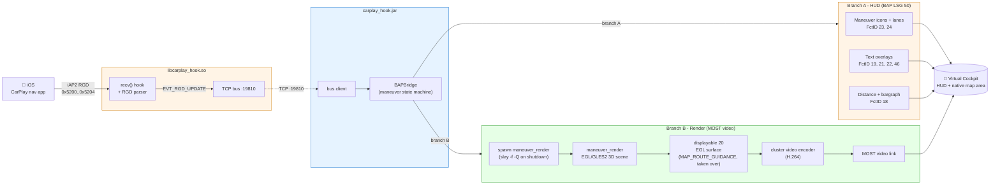
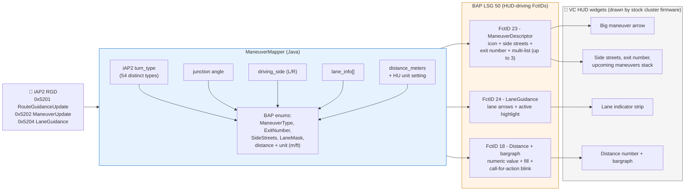
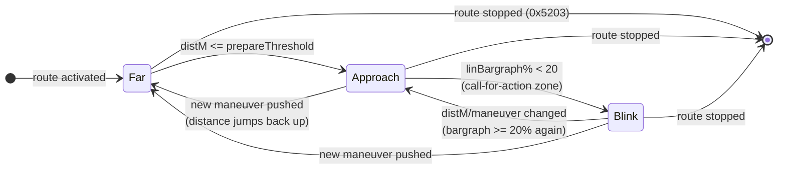
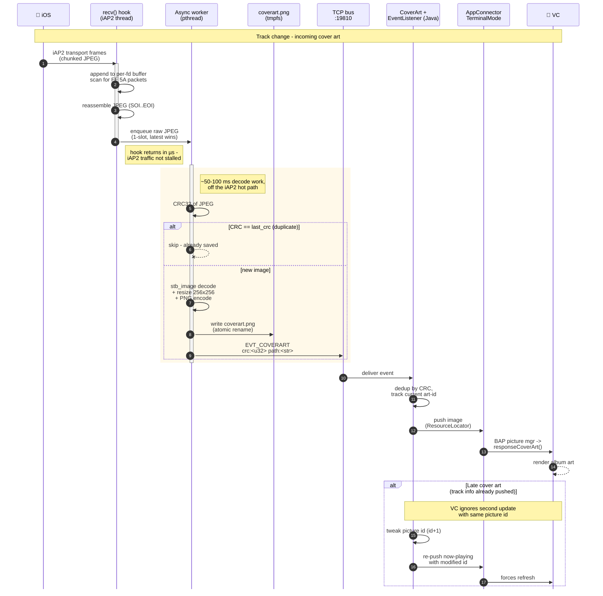
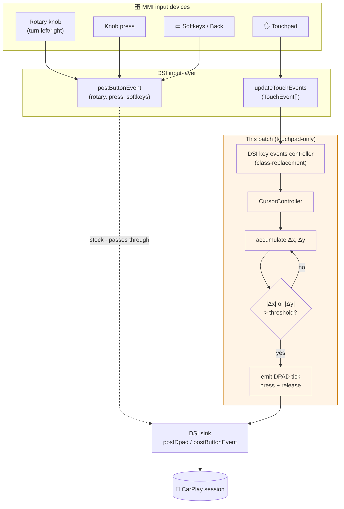
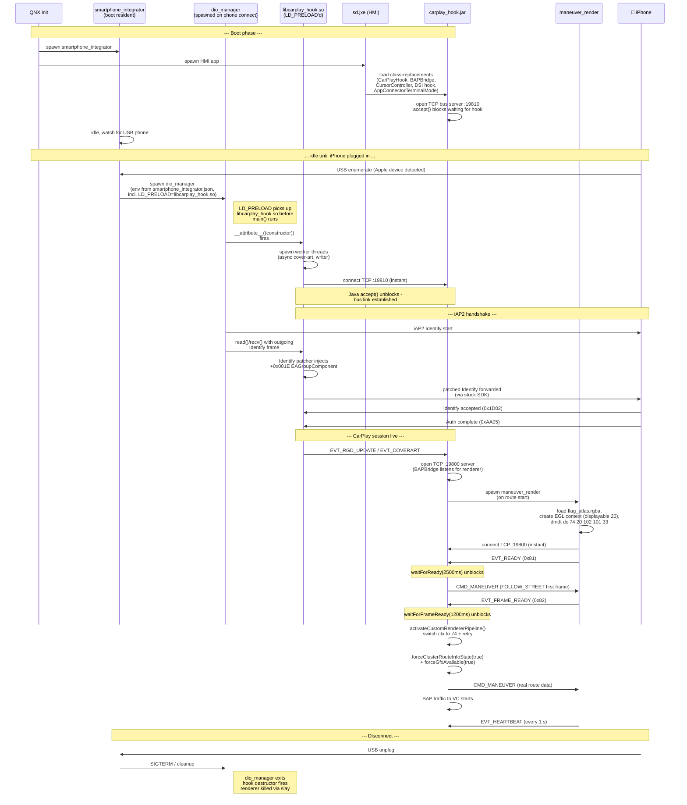

# MHI2 CarPlay Route Guidance

CarPlay patch set for Audi MHI2 infotainment.
(Based on MHI2Q firmware, but may need rebuild for different versions.)

**Disclaimer:** Use at your own risk. These patches modify firmware binaries and system configurations on your infotainment unit. Always back up all original files before making any changes. The authors are not responsible for any damage, bricked devices, or warranty issues resulting from use of these patches.

## Contents

- [Features](#features)
  - [Route Guidance](#route-guidance)
    - [Pipeline overview](#pipeline-overview)
    - [HUD (BAP)](#hud-bap)
    - [VC text overlays](#vc-text-overlays)
    - [VC MOST video (custom renderer)](#vc-most-video-custom-renderer)
    - [Bargraph synchronization](#bargraph-synchronization)
  - [Cover art](#cover-art)
  - [Touchpad input for CarPlay](#touchpad-input-for-carplay)
  - [Planned](#planned)
  - [Not possible - AltScreen](#not-possible--altscreen)
- [Architecture](#architecture)
  - [Patch components](#patch-components)
  - [Component map](#component-map)
  - [Boot / init sequence](#boot--init-sequence)
  - [Threading model](#threading-model)
  - [File system layout](#file-system-layout)
- [Why AltScreen is impossible (deep dive)](#why-altscreen-is-impossible-deep-dive)
  - [Call-by-call handshake - MHI3 (works) vs MHI2Q (broken)](#call-by-call-handshake---mhi3-works-vs-mu1316-broken)
  - [Component versions side-by-side](#component-versions-side-by-side)
- [Build](#build)
  - [Prerequisites](#prerequisites)
  - [libcarplay_hook.so (C hook)](#libcarplay_hookso-c-hook)
  - [maneuver_render (3D renderer)](#maneuver_render-3d-renderer)
  - [carplay_hook.jar (Java patch)](#carplay_hookjar-java-patch)
  - [Testing the renderer locally](#testing-the-renderer-locally)
- [Deploy](#deploy)
  - [Quick checklist](#quick-checklist)
  - [Step-by-step](#step-by-step)
- [Contributing](#contributing)
- [References](#references)

---

## Features

What this patch makes the head unit + cluster do that stock MHI2 doesn't:

- **Full HUD route guidance** from CarPlay nav (Maps, Waze, etc.) - maneuver icons, lanes, distance bargraph, ETA, destination
- **Custom 3D maneuver overlay** drawn into the cluster's MOST video stream (the same video plane the HU uses for its native map)
- **Album cover art** forwarded to the cluster's now-playing widget
- **MMI touchpad -> DPAD bridging** so finger drags navigate CarPlay menus

What it does **not** do, with explanations:

- **CarPlay AltScreen on cluster** - architecturally blocked on this HU generation, [see deep dive below](#why-altscreen-is-impossible-deep-dive)

### Route Guidance

#### Pipeline overview

iOS RGD messages enter through the iAP2 hook and fan out into **two
independent rendering branches** on the VC:

- **HUD branch** (BAP LSG 50) - feeds the text/icon HUD widgets the
  cluster firmware already knows how to draw. Cheap, always-on.
- **Render branch** (custom MOST-video renderer) - draws full 3D maneuver
  scenes into the cluster's video pipeline. Spawned only while a
  route is active.

Both branches receive the same parsed state from `BAPBridge` and
update in lock-step.



| Branch | Cost when idle | Cost per maneuver | When active |
|--------|----------------|-------------------|-------------|
| HUD (BAP) | ~0 | small BAP frames | always while CarPlay nav running |
| Render (MOST) | renderer process not spawned | EGL frame draws + H.264 encode | only while route is set |

The renderer is spawned by `BAPBridge` on the first maneuver and
killed on `0x5203 StopRouteGuidance`, so the MOST-video branch costs
nothing when the user isn't actively navigating.

#### HUD (BAP)

All data sent via BAP protocol (LSG 50) to the VC, which drives the HUD.



- [x] Maneuver icons - iAP2 turn type mapped to BAP ManeuverDescriptor (FctID 23). Supports turns, roundabouts, highway exits, merges, U-turns, ferry, etc.
- [x] Multi-maneuver list - up to 3 upcoming maneuvers sent in a single descriptor
- [x] Side streets at intersection - computed from iAP2 junction type + turn angle
- [x] Junction view - roundabout, highway interchange exit numbers
- [x] Left-hand / right-hand driving - auto-detected from iAP2 `driving_side`, affects icon mirroring and side-street layout
- [x] Distance to next maneuver - numeric display when far (FctID 18)
- [x] Distance bargraph - fills up on approach, with call-for-action blink at maneuver point (FctID 18)
- [x] Auto distance units - reads current HU setting (metric/imperial), no manual switch needed
- [x] Lane guidance - lane arrows with active-lane highlighting (FctID 24)

#### VC text overlays

Sent via the same BAP path. VC renders these as text bars over the native map area.

- [x] Turn-to street / exit name (FctID 23, part of ManeuverDescriptor)
- [x] Current road name (FctID 19)
- [x] Distance to destination (FctID 21)
- [x] ETA / remaining travel time - timezone-adjusted to HU local time (FctID 22)
- [x] Destination name (FctID 46)

#### VC MOST video (custom renderer)

Custom 3D renderer (`c_render/`) draws maneuver icons into the cluster's
**MOST video pipeline** (MOST150 isochronous channel - the same path
the HU uses to ship its native map render to the VC's Map tab).
Renders to QNX **displayable 20** (`DISPLAYABLE_MAP_ROUTE_GUIDANCE`, the
native KOMO RG widget slot in cluster context 74) via EGL/GLES2; the
frames are captured by the HU video encoder (H.264) and shipped over
MOST to the VC, where the cluster's TVMRCapture pipeline decodes them
into a texture composited by the Kanzi scene.

> **Displayable 20 is the native KOMO RG widget's slot — we take it
> over.** Verified by RE of `libdisplayinit.so`, `libdm_modMain.so`
> (displaymanager service), `libRenderSystem.so`, and stock
> `libPresentationController.so` (which runs in `AppStartATF`):
>
> - With stock libPresentationController, the native KOMO widget only
>   calls `display_create_window(20)` when its GuidanceView state
>   machine enters `StartDrawing` — which requires an active **native**
>   route.  In idle (CarPlay session, no native route) the native side
>   holds **no window** for displayable 20, so `m_surfaceSources[20]`
>   is empty before we start.
> - `display_create_window(displayable_id=20)` creates a screen window
>   in our process with `SCREEN_PROPERTY_ID_STRING="20"`.  Display
>   manager's `screen_manage_window` callback binds
>   `m_surfaceSources[20]` to our window — there is no race because
>   nothing else holds the slot.
> - `display_create_window` also strips other displayables from
>   context 74 as a side effect, so we follow up with
>   `dmdt dc 74 20 102 101 33` to re-declare the original composition
>   (our 20 + cluster's 102/101 + native map 33).
> - `setActiveDisplayable(4, 20)` (called by stock cluster firmware in
>   `preContextSwitchHook` for the leading displayable in context 74)
>   wires the MOST encoder to read displayable 20 — which is now our
>   window.
> - On renderer exit `screen_destroy_window` vacates
>   `m_surfaceSources[20]`.  The slot stays empty until native nav
>   activates a route — same as the cluster baseline before we
>   started.  `restore_display()` runs `dmdt sc 1 74` to keep the
>   context layout consistent.
>
> Edge case: if the user manually launches native maps mid-CarPlay,
> libPresentationController would create its own ID="20" window and
> displaymanager would last-writer-wins over us.  The 5 s reclaim
> watchdog (`platform_reclaim_displayable`) re-binds the slot back to
> us within seconds via `screen_manage_window`.

A 30 s focus watchdog runs `dmdt gs` to detect if native navigation
or another HMI process stole the cluster context, and re-routes via
`dmdt sc 1 74` (with a 30 s back-off so a stuck context doesn't
fork-bomb the system).

**Renderer startup handshake** (added to the TCP protocol so Java
doesn't expose the LVDS displayable to KOMO before a deterministic
frame is queued):

1. Renderer connects to Java's listen socket on `:19800`.
2. After EGL + render init, sends `EVT_READY` (0x81).
3. Java's `BAPBridge` blocks in `waitForReady(2500ms)` after launching
   the renderer; unblocks on `EVT_READY`.
4. Java sends a deterministic first frame (`sendRendererFollowStreet`).
5. Renderer swaps the frame and sends `EVT_FRAME_READY` (0x82).
6. Java's `waitForFrameReady(1200ms)` unblocks; only now does it call
   `csRef.activateCustomRendererPipeline()` (cluster context switch)
   and `forceGfxAvailable(true)` (KOMO publishes LVDS video).
7. If `activateCustomRendererPipeline` returns `FAILED:` (cluster
   stuck on another context after retry), the renderer is killed and
   gfx stays disabled — no LVDS video is published in a broken state.

`EVT_READY` and `EVT_FRAME_READY` are sticky: on TCP reconnect they
replay immediately so a Java-side restart still gets the right state
without a second renderer launch.

> **Note on naming.** Earlier drafts of this README called this branch
> "LVDS video". That was wrong for MHI2Q - LVDS exists on the
> platform (`DISPLAYSTATUS_LVDS_DM_ACTIVE` / `LVDS_HMI_ACTIVE` bits in
> `DSIKombiSync`) but is reserved for full-screen mirror modes
> (startup logo, standby). The HU->VC video for the Map tab on this
> generation rides MOST150, not LVDS.

```mermaid
flowchart LR
    iOS[("📱 iOS<br/>CarPlay nav app")]

    subgraph hookbox["libcarplay_hook.so"]
        direction TB
        recv["recv() hook"]
        rgd["RGD parser<br/>(rgd_hook.c)"]
        idpatch["Identify patcher<br/>+0x001E component<br/>+ msg IDs"]
        bus["TCP bus :19810"]
    end

    subgraph javabox["carplay_hook.jar"]
        direction TB
        bridge["BAPBridge<br/>maneuver state machine"]
        bus_cli["bus client<br/>(EVT_RGD_UPDATE)"]
    end

    subgraph rendbox["maneuver_render (separate process)"]
        direction TB
        atlas["flag_atlas.rgba<br/>14 frames x 128x128"]
        render["EGL/GLES2 3D scene<br/>(road, arrow, flag)"]
        wd["focus watchdog<br/>dmdt gs every 30s<br/>+ dmdt sc 1 74 if drifted<br/>(reclaims context 74)"]
        ready["lifecycle events<br/>EVT_READY (0x81)<br/>EVT_FRAME_READY (0x82)<br/>EVT_HEARTBEAT (0x80)"]
    end

    surf[("displayable 20<br/>(MAP_ROUTE_GUIDANCE, taken over)<br/>EGL surface")]
    enc[/"cluster video encoder<br/>(H.264)"/]
    most([MOST video link])
    vc[("🚗 Virtual Cockpit")]
    native["native KOMO RG widget<br/>on displayable 20<br/>(left intact, dropped<br/>from active ctx 74<br/>composition only)"]:::stock

    iOS -->|"0x5200<br/>StartRouteGuidance"| recv
    iOS -->|"0x5201<br/>RouteGuidanceUpdate"| recv
    iOS -->|"0x5202<br/>ManeuverUpdate"| recv
    iOS -->|"0x5203<br/>StopRouteGuidance"| recv
    iOS -->|"0x5204<br/>LaneGuidance"| recv

    recv --> rgd
    recv --> idpatch
    rgd -->|"parsed state"| bus
    bus -.->|"TCP :19810"| bus_cli
    bus_cli --> bridge

    bridge -->|"on route start:<br/>spawn /mnt/app/root/hooks/<br/>maneuver_render &"| rendbox
    bridge -->|"on shutdown:<br/>slay -f -Q maneuver_render"| rendbox
    bridge -->|"TCP :19800<br/>CMD_MANEUVER (48-byte fixed)"| render
    ready -->|"TCP :19800<br/>EVT_*"| bridge
    bridge -->|"BAP LSG 50<br/>FctID 18, 19, 21..24, 46"| vc

    atlas --> render
    render --> surf
    surf --> enc --> most --> vc
    wd -. "periodic dmdt sc 1 74" .-> surf
    native -. "m_surfaceSources[20] re-bound to our window<br/>(native widget loses active source slot)" .-> surf

    classDef stock fill:#fee,stroke:#900,stroke-dasharray: 5 5
    style hookbox fill:#fff4e6,stroke:#cc7700
    style javabox fill:#e6f3ff,stroke:#0066cc
    style rendbox fill:#e6ffe6,stroke:#008800
```



- [x] Procedural 3D maneuver icons (turns, roundabouts, U-turns, merges, lane changes, arrival)
- [x] Side streets at junctions from iAP2 junction angles
- [x] Animated route path with curvature-aware speed
- [x] Smooth push transitions between consecutive maneuvers (crossfade + path chaining)
- [x] Camera follow/settle during transitions
- [x] Arrow-to-bulb tip morphing for arrival
- [x] Animated destination flag sprite
- [x] Distance bargraph overlay with blink mode
- [x] Perspective/orthographic view with animated blend
- [x] FXAA + 2x SSAA anti-aliasing
- [x] Painter's algorithm road rendering (white outline + grey fill + blue active route)
- [x] TCP command protocol (port 19800) - Java bridge sends maneuver updates, renderer handles all animation autonomously

#### Bargraph synchronization

Both branches above (HUD `FctID 18` bargraph and the renderer's
on-screen bargraph overlay) need continuous fill + attention-grabbing
blink near the maneuver, but iOS sends `0x5202 ManeuverUpdate` at
sparse intervals (~1-3 s, faster on approach). `BAPBridge` smooths
that gap with a small state machine + a dedicated blink timer thread.

**Phases:**



**Key parameters** (in `BAPBridge.java`):

| Constant | Value | Meaning |
|----------|-------|---------|
| `CITY_PREPARE_THRESHOLD_M` | 1500 m | enter Approach zone (city maneuver) |
| `HIGHWAY_PREPARE_THRESHOLD_M` | 3000 m | enter Approach zone (highway maneuver) |
| `BARGRAPH_BLINK_PERCENT` | 20% | enter Blink phase when bargraph drops below |
| `ACTION_BLINK_INTERVAL_MS` | 600 ms | blink toggle period (50% duty) |

**Linear fill formula:** `linBargraph% = distM * 100 / prepareThreshold`
clamped to `[0, 100]`. Highway maneuvers use the wider 3000 m
denominator so the bar fills more gradually on a long approach.

**Blink loop** runs on a dedicated `BAPActionBlink` daemon thread
(spawned only while a route is active). Every 600 ms it toggles the
bargraph between 100% and 0% and re-sends `FctID 18` (HUD) plus a
`CMD_MANEUVER` tick to the renderer (overlay). This is **independent**
of iAP2 update cadence - even if iOS goes silent for 2 seconds, both
HUD and renderer still see the blink animation in lock-step.

**FSG-sync workaround.** `AppConnectorNavi.sendStatusIfChanged()`
silently drops updates when nothing in `{FctID 23, 18, 49}` changed.
On every ManeuverDescriptor send we toggle the cosmetic
`exitViewNum` variant on FctID 49 to force a transmission - without
that toggle the cluster occasionally misses bargraph ticks during
fast approach.

### Cover art

Stock MHI2 CarPlay (TerminalMode) forwards track title, artist, and album to the VC, but the stock `AppConnectorTerminalMode` never pushes cover art to the BAP picture manager. The VC always shows a blank/default album icon.



The C hook intercepts iAP2 transport packets (`read()`/`recv()` hooks),
reassembles JPEG cover art from chunked transfers, hands the complete
JPEG to a **dedicated async worker thread** (single-slot pending queue,
latest-wins coalescing) which decodes and resizes to 256x256 PNG using
stb_image and writes to `/var/app/icab/tmp/37/coverart.png` (tmpfs -
regenerated each session, lost on reboot, which is fine since the
decode pipeline restarts with every CarPlay handshake). The async
hand-off keeps the recv()/read() hook thread free, avoiding ~50-100 ms
of synchronous decode latency per cover art that previously stalled
concurrent iAP2 traffic during handshake. A TCP bus event
(`EVT_COVERART`, port 19810) signals Java. The Java `CoverArt` module
subscribes to the bus, and `TerminalModeBapCombi$EventListener` pushes
the image through `AppConnectorTerminalMode` to the BAP picture manager
with proper `ResourceLocator` and `responseCoverArt()` calls,
mirroring the native `AppConnectorMedia` pattern. Late-arriving cover
art (after track info was already sent) triggers a re-send with a
modified picture ID to force the VC to refresh.

- [x] Cover art forwarding to VC

### Touchpad input for CarPlay

Stock MHI2 forwards the rotary, knob press, back and softkey buttons
to CarPlay natively - those work out of the box. The **MMI touchpad
is the only input device that stock leaves unbridged**: finger
gestures on the touchpad never reach the CarPlay session.

This patch adds the missing leg of the chain:



The orange box is what this patch adds. Rotary, knob press and softkeys
already reach CarPlay through stock DSI (dotted path) - only the
touchpad needed bridging.

**Touchpad model.** A finger drag accumulates Δx / Δy; whenever either
axis crosses a speed-adaptive threshold, a `KEY_DPAD_*` press+release
pair is emitted and the threshold is subtracted. A long drag emits
multiple ticks so the user can traverse several list items in one
gesture.

(The class is named `CursorController` for legacy reasons - it once
drove an on-screen cursor that was abandoned because MHI2Q's H.264
encoder ghosted the overlay through motion compensation. See
`docs/` notes if curious.)

- [x] MMI touchpad drag -> DPAD navigation
- Knob rotary, knob press, back / softkey buttons - already work via stock DSI, no patch needed

### Planned

- [ ] Lane guidance on maneuver renderer (CMD_LANE_GUIDANCE protocol, arrow glyphs with status colors + dashed separators, see `docs/plan_lane_guidance_renderer.md`)

### Not possible - AltScreen

CarPlay second screen on the instrument cluster cannot be enabled on
MHI2Q - and **no wireless dongle fixes it**. The blocker is on the
HU side (Cinemo iAP2 SDK + libairplay 210.81), not on the phone or
USB transport. Full reverse-engineering write-up + diagrams in
[Why AltScreen is impossible](#why-altscreen-is-impossible-deep-dive)
below.

---

## Architecture

### Patch components

| Component                    | Type                  | Purpose                                                                                          | Output                |
|------------------------------|-----------------------|--------------------------------------------------------------------------------------------------|-----------------------|
| `c_hook/`                    | C (ARM32 QNX)         | iAP2 hooks, route guidance + async cover-art bridge, TCP bus client (connects to Java :19810)    | `libcarplay_hook.so`  |
| `c_render/`                  | C (ARM32 QNX / macOS) | Custom 3D maneuver renderer (EGL/GLES2), TCP command-driven                                      | `maneuver_render`     |
| `java_patch/`                | Java patch JAR        | Route guidance rendering, BAP bridge, cover art forwarder, MMI touchpad / D-pad -> CarPlay input  | `carplay_hook.jar`    |
| `dio_manager.json`           | System config patch   | Enables iAP2 route guidance message exchange with iOS                                            | Manual edit on device |
| `smartphone_integrator.json` | System config patch   | Loads `libcarplay_hook.so` via `LD_PRELOAD` in dio_manager process                               | Manual edit on device |

### Component map

```mermaid
flowchart LR
    iPhone[("📱 iPhone<br/>iAP2 / CarPlay")]

    subgraph mmi["MMI input"]
        direction TB
        touchpad["Touchpad"]
        dpad_btn["Knob / softkeys / back<br/>(stock - passes through)"]
    end

    subgraph cfg["System config (manual edits)"]
        direction TB
        cfg_int["smartphone_integrator.json<br/>(LD_PRELOAD declaration)"]
        cfg_dio["dio_manager.json<br/>(0x5200..0x5204 registration)"]
    end

    subgraph HU["🖥️ Audi MHI2Q Head Unit (QNX 6.5, Qualcomm)"]
        direction TB

        subgraph dio["dio_manager process (Cinemo iAP2 SDK)"]
            direction TB
            subgraph hook["libcarplay_hook.so - LD_PRELOAD'd"]
                direction TB
                iap2["iAP2 transport hooks<br/>read() / recv() intercept<br/><i>(iAP2 thread)</i>"]
                idpatch["Identify patcher<br/>+0x001E EAGroupComponent<br/>+ msg-IDs runtime patch"]
                rgd["RGD parser<br/>0x5200..0x5204<br/>+ 0x52xx unknown warn"]
                cover["Cover-art bridge<br/>chunked JPEG reassembly"]
                worker["Async decode worker<br/>stb_image -> 256x256 PNG<br/>(pthread, coalesced queue)"]
                bus[("TCP bus client<br/>connects to Java :19810<br/><i>connector + writer + reader<br/>+ heartbeat threads</i>")]
                hb["Heartbeat thread<br/>EVT_PONG every 1 s<br/>(liveness signal for Java)"]
                cksum["iAP2 cksum<br/>(NEG, hard-coded)<br/>+ sanity log"]
            end
        end

        subgraph hmi["HMI process (lsd.jxe + class-replacements)"]
            direction TB
            subgraph jar["carplay_hook.jar"]
                direction TB
                carplayhook["CarPlayHook<br/>(lifecycle coordinator,<br/>retry thread)"]
                bapbridge["BAPBridge<br/>(maneuver state machine,<br/>BAPActionBlink thread)"]
                cursor["CursorController<br/>(touchpad Δx/Δy -> DPAD,<br/>speed-adaptive threshold)"]
                dsihook["TerminalModeDSIKeyEvents<br/>Controller (class-replaced)"]
                covjava["AppConnectorTerminalMode<br/>(class-replaced -<br/>cover art -> BAP picture mgr)"]
                bussrv["TCP bus server<br/>listens on :19810<br/>SO_TIMEOUT 5 s = dead<br/>(accept + reader + writer threads)"]
                rendsrv["RendererServer<br/>listens on :19800<br/>SO_TIMEOUT 5 s = dead<br/>(non-blocking accept thread)"]
                tmevent["TerminalModeBapCombi$<br/>EventListener (class-replaced)"]
            end
        end

        renderer["maneuver_render<br/>(separate ARM ELF process)<br/>EGL/GLES2 3D scene -> displayable 20<br/>(takes over native MAP_ROUTE_GUIDANCE slot)<br/>+ dmdt focus watchdog (30s, 30s back-off)<br/>+ EVT_READY/EVT_FRAME_READY (sticky)<br/>+ EVT_HEARTBEAT every 1 s"]

        subgraph filesys["File system / tmpfs"]
            direction TB
            fs_cov[("/var/app/icab/tmp/37/<br/>coverart.png<br/>(tmpfs)")]
            fs_log_hook[("/tmp/carplay_hook.log<br/>(tmpfs, reset on reboot)")]
            fs_log_ren[("/tmp/maneuver_render.log<br/>(tmpfs, reset on reboot)")]
        end
    end

    subgraph VC["🚗 Virtual Cockpit (cluster, NVIDIA Tegra 2 SoC)"]
        direction TB
        most_rx["MOST RX +<br/>TVMRCapture"]
        kanzi["Kanzi scene composite<br/>(stock cluster firmware)"]
        hud_widgets["HUD widgets<br/>maneuver arrow,<br/>distance + bargraph,<br/>lane indicator,<br/>text overlays"]
        map_area["Native map area<br/>(receives MOST video<br/>+ our 3D overlay)"]
        most_rx --> kanzi
        kanzi --> hud_widgets
        kanzi --> map_area
    end

    cfg_int -.->|"declares LD_PRELOAD"| dio
    cfg_dio -.->|"registers RGD msg IDs<br/>in Cinemo SDK"| dio

    iPhone <-->|"USB iAP2 (MOST150)"| iap2
    iap2 --> idpatch
    iap2 --> rgd
    iap2 --> cover
    iap2 -.->|"verify on first stock frame"| cksum
    cover --> worker
    rgd -->|"EVT_RGD_UPDATE"| bus
    worker -->|"EVT_COVERART"| bus
    hb -->|"EVT_PONG (1 Hz)"| bus
    worker --> fs_cov
    hook -.->|"writes"| fs_log_hook

    bus -->|"connect TCP :19810"| bussrv
    bussrv -->|"deliver events"| tmevent
    tmevent --> bapbridge
    tmevent --> covjava
    bapbridge -->|"TCP :19800<br/>CMD_MANEUVER (48B)"| rendsrv
    rendsrv -->|"connect TCP :19800"| renderer
    renderer -->|"EVT_HEARTBEAT (1 Hz)"| rendsrv
    bapbridge -->|"BAP LSG 50<br/>FctID 18, 19, 21..24, 46"| hud_widgets
    covjava -->|"BAP picture mgr<br/>responseCoverArt()"| hud_widgets
    fs_cov -.->|"read PNG"| covjava

    touchpad -->|"DSI updateTouchEvents"| dsihook
    dsihook --> cursor
    cursor -->|"DSI postDpad<br/>KEY_DPAD_*"| iap2
    dpad_btn -.->|"DSI postButtonEvent<br/>(stock path)"| iap2

    renderer -->|"displayable 20<br/>(EGL surface, MAP_ROUTE_GUIDANCE)"| most_encoder
    most_encoder -->|"H.264 over MOST150"| most_rx
    renderer -.->|"writes"| fs_log_ren

    most_encoder([HU video encoder<br/>H.264])

    style hook fill:#fff4e6,stroke:#cc7700
    style jar fill:#e6f3ff,stroke:#0066cc
    style renderer fill:#e6ffe6,stroke:#008800
    style filesys fill:#f5f5f5,stroke:#999,stroke-dasharray: 3 3
    style cfg fill:#fff,stroke:#888,stroke-dasharray: 4 4
    style mmi fill:#fff,stroke:#888
    style VC fill:#f8f8ff,stroke:#666
```



The diagram shows a single CarPlay session at steady state. **Cinemo
SDK** is implicit - every iAP2 byte from iPhone first passes through
our `read()` / `recv()` hooks, then continues into the stock SDK code
underneath. We don't bypass the stock path; we intercept and (for
RGD / Identify / cover art) inject side effects.

### Boot / init sequence

**Important:** `dio_manager` is **not** spawned at boot. It is launched
on demand by the always-running `smartphone_integrator` process when
a phone is detected on USB. That's why our `libcarplay_hook.so`
constructor (`LD_PRELOAD`) only fires when the phone is plugged in,
not at QNX boot. The HMI process (`lsd.jxe`) does start at boot, so
`carplay_hook.jar` class-replacements load early - the Java bus
server `accept()`s as soon as the C hook connects.

**Topology** (lifetime hierarchy):

- Java HMI (long-lived, alive from boot) = TCP **server** on :19810
  for the bus, opens :19800 for the renderer at session start.
- C hook (short-lived, per phone connect) = TCP **client**, connects to
  Java's :19810. Idempotent reconnect on Java HMI restart.
- Renderer (short-lived, per route) = TCP **client**, connects to
  Java's :19800. Idempotent reconnect on Java side restart.

**Liveness detection** (heartbeat-based):

- C hook sends `EVT_PONG` every 1 s; Java has `SO_TIMEOUT=5 s` on the
  accepted socket. Five seconds of silence → reader exits → bus
  re-accepts a fresh hook connection. Catches force-killed
  `dio_manager` whose TCP state may linger.
- Renderer sends `EVT_HEARTBEAT` (cmd=0x80) every 1 s; same 5 s
  timeout pattern in `RendererServer`. Hung renderer detected
  within 5 s, then 3 consecutive send failures (~1.8 s) trigger
  `slay -f -Q` + respawn.



### Threading model

| Thread | Process | Role |
|--------|---------|------|
| iAP2 main | dio_manager | runs Cinemo SDK, calls `read()`/`recv()` - our hooks intercept on this thread |
| Cover-art worker | dio_manager | pthread - picks complete JPEGs off the 1-slot queue, decodes, writes PNG, emits `EVT_COVERART` |
| Bus connector | dio_manager | TCP client - `connect()` to Java :19810 with retry, reconnect on disconnect |
| Bus writer | dio_manager | drains outbound event queue |
| Bus reader | dio_manager | parses inbound frames, dispatches to handlers, exits on EOF/error |
| Bus heartbeat | dio_manager | sends `EVT_PONG` every 1 s while connected (Java liveness signal) |
| HMI EDT | HMI process | UI loop - calls `setMMIDisplayStatus`, picture mgr, etc. |
| `CarplayBus-IO` | HMI process | accept loop on :19810 (one-at-a-time, force-replace stale) |
| `CarplayBus-Read` | HMI process | per-conn reader, `SO_TIMEOUT=5 s` triggers re-accept on hook silence |
| `BAPActionBlink` | HMI process | daemon - 600 ms ticks for bargraph blink animation |
| `CarPlayHook-Retry` | HMI process | retries `tryInit()` if OSGi services aren't ready yet |
| `RendererServer-Accept` | HMI process | accept loop on :19800, replaces socket on each new renderer connect |
| `RendererServer-Read` | HMI process | per-conn reader, parses `EVT_READY`/`EVT_FRAME_READY`/`EVT_HEARTBEAT`, `SO_TIMEOUT=5 s` triggers reconnect |
| Renderer main | maneuver_render | EGL/GLES2 draw loop, TCP client to Java :19800; sends `EVT_READY` after init, `EVT_FRAME_READY` on first swap, `EVT_HEARTBEAT` every 1 s |
| Renderer focus check | maneuver_render | one-shot detached pthread spawned every ~30 s by main loop; runs `dmdt gs` and re-routes via `dmdt sc 1 74` if context drifted (with 30 s back-off) |

### File system layout

| Path | Type | Lifetime | Purpose |
|------|------|----------|---------|
| `/mnt/app/root/hooks/libcarplay_hook.so` | persistent | survives reboot | C hook binary |
| `/mnt/app/root/hooks/maneuver_render` | persistent | survives reboot | Renderer ARM ELF |
| `/mnt/app/root/hooks/flag_atlas.rgba` | persistent | survives reboot | Renderer flag sprite atlas |
| `/mnt/app/eso/hmi/lsd/jars/carplay_hook.jar` | persistent | survives reboot | Java patch JAR |
| `/mnt/system/etc/eso/production/smartphone_integrator.json` | persistent | survives reboot | declares `LD_PRELOAD` |
| `/mnt/system/etc/eso/production/dio_manager.json` | persistent | survives reboot | registers RGD msg IDs |
| `/var/app/icab/tmp/37/coverart.png` | tmpfs | until reboot | current album art (regenerated each session) |
| `/tmp/carplay_hook.log` | tmpfs | until reboot | C hook + Java event log |
| `/tmp/maneuver_render.log` | tmpfs | until reboot | renderer stderr |

---

## Why AltScreen is impossible (deep dive)

Branch closed 2026-04-23 after full static reverse of iOS 26.1, MHI3 and
MHI2Q. **AltScreen (CarPlay second screen on the instrument cluster)
cannot be enabled on MHI2Q wired CarPlay - and no wireless dongle
fixes this**, because every gate that breaks the negotiation is on the
**head-unit side**, not on the phone or USB transport.

### What the head unit needs to advertise

For iOS to enable AltScreen, the head unit's iAP2 + AirPlay stack must
declare two capabilities to the iPhone:

1. **Themed-assets capability** - a flag in the head unit's iAP2
   "introduction card" (the Identification message) saying *"I can
   render Apple's themed CarPlay UI elements on a second display."*
   In the wire format this is `Param 21, sub-parameter 17`. iOS reads
   it via `_parseIdentificationParams_3()` and on `YES` sets internal
   capability bit 21 in `_eaAccessoryCapabilities`, which CarKit
   later checks via `setSupportsThemeAssets:YES` to expose `altScreen`
   in its proposed feature array.

2. **Two-screen layout** - the head unit's `libairplay` must answer
   the AirPlay `/info` query with a dict that contains **two screens**
   (main + alt), each with its own view areas. The library API for
   this is `MainScreenDictCreate` + `AltScreenDictCreate` +
   `ScreenDictSetViewAreas`, plus advertising AirPlay **stream type
   111** and **feature bit 26** (`0x04000000`) so iOS opens an
   AltScreen video stream.

MHI2Q fails both:

| Layer | What MHI2Q ships | Why it fails |
|-------|-------------------|--------------|
| iAP2 SDK (Cinemo, pre-2020) | Only knows two flags: `SUPPORTS_IAP2_CONNECTION`, `SUPPORTS_CARPLAY`. No notion of `Param 21` or the themed-assets sub-parameter. | iAP2 introduction never carries the themed-assets flag -> iOS leaves capability bit 21 cleared -> CarKit never adds `altScreen` to its proposed features |
| libairplay (210.81) | `CopyDisplaysInfo()` returns a flat single-screen dict. No `MainScreenDictCreate` / `AltScreenDictCreate`, no `ScreenDictSetViewAreas`, no stream type 111 in advertised types. | Even if the iAP2 layer somehow passed, AirPlay /info would not advertise altScreen, and there's no two-screen geometry to send |

A wireless adapter (Carlinkit / U2W / etc.) emulates a wired
carplay accessory **on the iPhone end of the link** - it speaks
the same iAP2 to the same `dio_manager` on MHI2Q, hits the same
Cinemo SDK, gets stuck at the same first failure. The dongle cannot
rewrite the HU's iAP2 SDK or libairplay version. **No dongle,
present or future, will unlock AltScreen on this generation of HU.**

### Quick glossary of terms below

| Term | What it means |
|------|---------------|
| `Param 21 + sub17` | iAP2 Identification field declaring "I support themed CarPlay UI" |
| `_eaAccessoryCapabilities` bit 21 | iOS-internal capability bitmask, bit 21 = themed-assets supported |
| `setSupportsThemeAssets:YES` | iOS CarKit method that exposes `altScreen` once bit 21 is set |
| `MainScreenDictCreate` / `AltScreenDictCreate` | libairplay helpers building the two-screen `/info` response |
| `ScreenDictSetViewAreas` | libairplay helper attaching view geometry to a screen dict |
| Stream type 111 | AirPlay isochronous stream type number reserved for AltScreen video |
| Feature bit 26 (`0x04000000`) | AirPlay feature flag in `/info` declaring AltScreen capability |
| `CopyDisplaysInfo` | libairplay function building the AirPlay `/info` displays section |
| Cinemo SDK | Pre-2020 third-party iAP2 stack used by MHI2Q |

### Call-by-call handshake - MHI3 (works) vs MHI2Q (broken)

Single sequence diagram showing the actual function calls and message
exchanges during AltScreen negotiation. Both head-unit variants share
the same iOS code path; the differences are in two specific HU
components (Cinemo iAP2 SDK and libairplay).

Color coding inside the diagram:
- **Green `rect`** = MHI3-grade (modern SDK + libairplay 450.x) - passes
- **Red `rect`** = MHI2Q (Cinemo pre-2020 + libairplay 210.81) - fails
- **No tint** = shared protocol layer that runs identically on both

```mermaid
flowchart TB
    iOS([USB enumerate -> iAP2 link layer up -> Identification msg 0xEA00<br/>iOS-side gates 0,1,2,4 pre-pass on iPhone 12+])

    iOS --> P0

    subgraph P0 [Phase 0 - Discovery: Bonjour TXT srcvers]
        direction LR
        p0_mhi["<b>MHI3</b> srcvers=450.14.2<br/>(analytics only - NOT gated)"]:::ok
        p0_mu["<b>MHI2Q</b> srcvers=210.81<br/>(analytics only - NOT gated)"]:::neut
        p0_mhi ~~~ p0_mu
    end

    P0 --> P1

    subgraph P1 [Phase 1 - iAP2 Identification 0xEA00: HU advertises themed-assets via subparam 17]
        direction LR
        p1_mhi["<b>MHI3 PASSES (Gate 3)</b><br/><br/>libesoiap2.so::iap2:: <br/>CIAP2ControlSessionModuleIdentMsgComposer:: <br/>identificationInformation @ 0x4F9A0<br/><br/>Loc2 @ 0x519C4 - Param 21<br/>(WirelessCarplayTransportComponent):<br/>subparam_alloc(buf, 0)   /* sub_4A400 */<br/>buf[0] = void_marker_vtable   /* off_A64E8 */<br/>subparam_emit(buf, 17)   /* sub_48370 */<br/><br/>Wire bytes: 00 04 00 11<br/>(len=4, id=0x11, no payload)<br/><br/>iOS CoreAccessories<br/>_parseIdentificationParams_3<br/>case 17: iAP2MsgIsDataVoid -> v414=1<br/>output[131] = 1<br/><br/>iOS CoreAccessories<br/>iap2_identification_isIdentifiedForThemeAssets<br/>returns *(struct + 131) & 1 = 1<br/><br/>iOS ACCExternalAccessory<br/>caps |= 0x200000 (bit 21)<br/><br/>iOS CarKit/CRVehicleAccessoryManager<br/>[v setSupportsThemeAssets:(caps &gt;&gt; 21) &amp; 1]<br/>= YES<br/><br/>iOS CarKit.mm CRCarPlayFeaturesAsAirPlayFeatures:<br/>bit 0 -> CFArray += @&quot;altScreen&quot;"]:::ok

        p1_mu["<b>MHI2Q FAILS (Gate 3)</b><br/><br/>No libesoiap2.so present in firmware.<br/>iAP2 logic embedded in dio_manager<br/>(via Cinemo SDK + libNmeSDK.so).<br/><br/>Cinemo capability API exposes ONLY:<br/>- SUPPORTS_IAP2_CONNECTION<br/>- SUPPORTS_CARPLAY<br/>No CMessageParameterWirelessCarplay-<br/>TransportComponent class.<br/>No subparam 10..18 support.<br/>No void_marker_vtable system.<br/><br/>Identify message has no Param 21<br/>structured TLV - just two bools.<br/><br/>iOS CoreAccessories<br/>_parseIdentificationParams_3<br/>case 17 path NEVER hit<br/>output[131] = 0<br/><br/>iOS CoreAccessories<br/>iap2_identification_isIdentifiedForThemeAssets<br/>returns 0<br/><br/>iOS ACCExternalAccessory<br/>caps bit 21 stays 0<br/><br/>iOS CarKit/CRVehicleAccessoryManager<br/>setSupportsThemeAssets: NO<br/><br/>iOS CarKit.mm CRCarPlayFeaturesAsAirPlayFeatures:<br/>@&quot;altScreen&quot; NEVER added to CFArray"]:::bad

        p1_mhi ~~~ p1_mu
    end

    P1 --> P2

    subgraph P2 [Phase 2 - AirPlay RTSP SETUP: HU echoes enabledFeatures + handles AltScreen stream type]
        direction LR
        p2_mhi["<b>MHI3 PASSES (Gates 5+6)</b><br/><br/>libairplay 450.14.2:<br/><br/>AirPlayCopyServerInfo @ 0x4F900<br/>builds /info CFDict with:<br/>- displays array (Main + Alt)<br/>  via AirPlayAltScreenDictCreate @ 0x5F860<br/>  + AirPlayInfoArrayAddScreen @ 0x5FEC0<br/>- AirPlayScreenDictSetViewAreas @ 0x5F990<br/>  per-screen geometry<br/>- features |= bit 26 (0x04000000)<br/>- streamTypes contains 111<br/><br/>iOS sends RTSP SETUP with proposed<br/>features incl @&quot;altScreen&quot;.<br/><br/>libairplay SessionSetup builds response<br/>CFDict with key @&quot;enabledFeatures&quot;:<br/>CFArray = [@&quot;altScreen&quot;, @&quot;viewAreas&quot;,<br/>@&quot;uiContext&quot;, @&quot;cornerMasks&quot;,<br/>@&quot;focusTransfer&quot;]<br/><br/>(rodata @ 0x115478 for key,<br/>0x1153D0..0x115418 for values)<br/><br/>iOS AirPlaySender/Activate<br/>CFArrayContainsValue(arr, @&quot;altScreen&quot;)<br/>-> derived[63] = 1 (altScreen enabled)<br/><br/>Stream type=111 dispatched to AltScreen<br/>handler -> ScreenStreamProcessData ->><br/>compositor pipeline -> cluster display."]:::ok

        p2_mu["<b>MHI2Q FAILS (Gates 5+6)</b><br/><br/>libairplay 210.81 (predates Ferrite):<br/><br/>0 string matches for:<br/>- @&quot;altScreen&quot; / @&quot;enabledFeatures&quot;<br/>- @&quot;viewAreas&quot; / @&quot;cornerMasks&quot;<br/>- @&quot;focusTransfer&quot; / @&quot;uiContext&quot;<br/><br/>0 symbol matches for:<br/>- AirPlayAltScreenDictCreate<br/>- AirPlayInfoArrayAddScreen<br/>- AirPlayScreenDictSetViewAreas<br/>- AirPlayReceiverSessionHasFeatureAltScreen<br/><br/>/info CFDict contains only single<br/>(main) display, no enabledFeatures key<br/>in SETUP response.<br/><br/>iOS AirPlaySender/Activate<br/>CFArrayContainsValue(arr, @&quot;altScreen&quot;)<br/>= false (key absent)<br/>derived[63] = 0<br/><br/>libairplay AirPlayReceiverSessionSetup<br/>@ 0x272B8 stream-type switch:<br/>case 100/101: handle audio<br/>case 110: mainscreen_setup   /* sub_26F9C */<br/>default: LogInfo(&quot;Unsupported stream<br/>type: %d&quot;) goto skip<br/><br/>type=111 falls into default ->><br/>&quot;Unsupported stream type: 111&quot; logged.<br/>Even if iOS opened it, refused here."]:::bad

        p2_mhi ~~~ p2_mu
    end

    P2 --> P3

    subgraph P3 [Phase 3 - End state]
        direction LR
        p3_mhi["<b>MHI3 - altScreen ACTIVE</b><br/><br/>iOS opens RTSP RECORD<br/>type=111 AltScreen stream.<br/>Frames flow ScreenStreamProcessData<br/>-> H.264 decode -> Kanzi composite<br/>-> cluster TFT display.<br/><br/>themed CarPlay UI rendered on<br/>instrument cluster's second screen."]:::ok

        p3_mu["<b>MHI2Q - altScreen NEVER</b><br/><br/>Phase 1 already broke - altScreen<br/>missing from CarKit feature array<br/>so iOS never proposes it in SETUP.<br/><br/>Phase 2 also broken independently -<br/>even if Phase 1 magically passed,<br/>SETUP response lacks enabledFeatures<br/>and stream 111 handler.<br/><br/>Two independent failures.<br/>No dongle bypasses HU-side stack."]:::bad

        p3_mhi ~~~ p3_mu
    end

    classDef ok fill:#efe,stroke:#0a0,color:#040
    classDef bad fill:#fee,stroke:#900,color:#600
    classDef neut fill:#eef,stroke:#447,color:#224
    style P0 fill:#e8e8e8,stroke:#444,color:#000
    style P1 fill:#e8e8e8,stroke:#444,color:#000
    style P2 fill:#e8e8e8,stroke:#444,color:#000
    style P3 fill:#e8e8e8,stroke:#444,color:#000
```



> **Static-analysis sources** (offsets/strings cross-referenced):
> - **MHI3** — `MHI3_ER_AU_P4364_8W0906961DR/libesoiap2.so` (629 KB ARM64) +
>   `_swup_carplay_aa/extracted_elf_opt/libairplay.so` (450.14.2)
> - **MHI2Q** — `dio_manager.i64` + `libNmeSDK.so` + MHI2Q appimg
>   `libairplay.so` (210.81)
> - **iOS 26.1** — `CoreAccessories.framework`, `CarKit.framework`,
>   `AirPlayReceiver.framework`, `AirPlaySender.framework`, `carkitd`
>
> Full file/function map: [`docs/altscreen_gate_analysis.md`](docs/altscreen_gate_analysis.md).

The diagram makes the **two independent failure points** visually
explicit:

1. **Phase 1 fails on MHI2Q** because Cinemo's pre-2020 iAP2 SDK
   doesn't emit Param 21 / sub17, so iOS never marks the accessory
   as themed-assets-capable, and CarKit's feature array never grows
   the `"altScreen"` string.
2. **Phase 2 fails independently on MHI2Q** because libairplay 210.81
   has no `MainScreenDictCreate` / `AltScreenDictCreate` /
   `ScreenDictSetViewAreas` helpers; even if Phase 1 magically passed,
   the `/info` response still lacks the two-screen shape, feature bit
   26, and stream type 111 that iOS requires.

A wireless dongle (Carlinkit / U2W) replaces only the iPhone-side
iAP2 endpoint. The HU's `Cinemo SDK` and `libairplay 210.81` stay the
same - both red phases still fail. **No dongle, present or future,
will turn the red rects green on this generation of HU.**

### Component versions side-by-side

| Layer | iOS expects | MHI2Q (broken) | MHI3-grade (works) |
|-------|-------------|-----------------|--------------------|
| Gates 1-3 (iAP2 Identification) - Cinemo SDK | Param 21 + subparam 17 | pre-2020 SDK, no Param 21 | SDK >= 2020, emits Param 21 |
| Gates 4-6 (AirPlay /info) - libairplay | Alt/Main dict helpers, stream 111, feature bit 26 | 210.81, flat dict only | 450.14.2, full helpers |
| Wireless dongle viable? | n/a | NO - same stack still fails | yes - wireless == wired here |

---

## Build

### Prerequisites

- **QNX SDP 6.5** - needed for cross-compiling C hook and renderer to ARM32 QNX. Easiest way is a QNX VM with the toolchain accessible over SSH.
  QNX VM image: https://archive.org/details/qnxsdp-65.7z (or any other QNX SDP 6.5 VM image available online).
  Set up SSH on the VM and configure the IP in the build scripts.

- **GLFW 3** (macOS only) - needed for local renderer development/testing. Install via `brew install glfw`.

- **lsd.jar** - original HU classes, needed to compile the Java patch against. Extract from your firmware dump:
  1. Get `/mnt/app/eso/hmi/lsd/lsd.jxe` from your firmware
  2. Convert with [jxe2jar](https://github.com/luka-dev/jxe2jar) (`../jxe2jar`)
  3. Output lands in `jxe2jar/out/lsd.jar` (default path used by `build_java.sh`)

### `libcarplay_hook.so` (C hook)

Cross-compiles on the QNX VM via SSH. Set `QNX_VM` IP in `compile_hook.sh`.

```bash
./compile_hook.sh
```

Output: `./libcarplay_hook.so`

Build flags:

| Flag                 | Default | Description                                 |
|----------------------|---------|---------------------------------------------|
| `LOG`                | `1`     | Enable/disable all logging                  |
| `LOG_RGD_PACKET_RAW` | `0`     | Full raw RGD packet dump (requires `LOG=1`) |

```bash
# default (logging on)
./compile_hook.sh

# silent build
LOG=0 ./compile_hook.sh

# verbose packet logging
LOG=1 LOG_RGD_PACKET_RAW=1 ./compile_hook.sh
```

### `maneuver_render` (3D renderer)

**For QNX (deployment):** Cross-compiles on the QNX VM via SSH. Set `QNX_VM` IP in `compile_render_qnx.sh`.

```bash
./compile_render_qnx.sh
```

Output: `./maneuver_render`

To build with the debug grid overlay:

```bash
./compile_render_qnx.sh grid
```

**For macOS (local development):** Builds natively with GLFW + OpenGL 2.1. Requires `brew install glfw`.

```bash
make -C c_render
```

Output: `c_render/c_render` (renderer) + `c_render/test_harness` (test client)

The macOS build also compiles a test harness - see [Testing the renderer locally](#testing-the-renderer-locally) below.

### `carplay_hook.jar` (Java patch)

Requires `lsd.jar` (see [Prerequisites](#prerequisites)). Check paths in `build_java.sh`.

```bash
./build_java.sh
```

Output: `./carplay_hook.jar`

All classes are compiled with `-source 1.2 -target 1.2` for MHI2Q JVM compatibility. The bundled JDK from jxe2jar is used automatically.

### Testing the renderer locally

https://github.com/luka-dev/mib2q-carplay-rgi/raw/main/docs/test_manuver_render.mov

The macOS build includes a **test harness** (`c_render/test_harness`) that sends TCP commands to the renderer, letting you cycle through all maneuver types and verify animations without a real device.

Run both in parallel:

```bash
cd c_render
./c_render & ./test_harness
```

The renderer window opens and the harness connects to `127.0.0.1:19800`.

**Harness controls:**

| Key          | Action                                                                               |
|--------------|--------------------------------------------------------------------------------------|
| Left / Right | Cycle through maneuver presets (turns, roundabouts, U-turns, merges, arrivals, etc.) |
| R            | Send a random maneuver with random angle, junction streets, and bargraph             |
| P            | Toggle perspective / orthographic view                                               |
| D            | Toggle debug grid overlay                                                            |
| Space        | Save screenshot (PPM)                                                                |
| S            | Toggle sidescreen / popup viewport mode                                              |
| Q / Esc      | Quit                                                                                 |

The harness auto-cycles through a built-in preset list that covers all icon types with varying directions, exit angles, junction configurations, and bargraph levels. Each arrow key press sends a `CMD_MANEUVER` packet triggering a push transition.

---

## Deploy

### Quick checklist

1. `./compile_hook.sh` - build `libcarplay_hook.so`
2. `./compile_render_qnx.sh` - build `maneuver_render`
3. `./build_java.sh` - build `carplay_hook.jar`
4. `mkdir -p /mnt/app/root/hooks` on device
5. Copy `libcarplay_hook.so` to `/mnt/app/root/hooks/`, `chmod 755`
6. Copy `maneuver_render` to `/mnt/app/root/hooks/`, `chmod 755`
7. Copy `c_render/resources/flag_atlas.rgba` to `/mnt/app/root/hooks/`
8. Copy `carplay_hook.jar` to `/mnt/app/eso/hmi/lsd/jars/`
9. Set `LD_PRELOAD` in `smartphone_integrator.json`
10. Add `0x5200/01/02/03/04` IDs in `dio_manager.json`
11. Reboot (wait 30s after file changes)

### Step-by-step

#### Step 1: Create hooks directory

The hooks directory does not exist by default. Create it on the device:

```bash
mkdir -p /mnt/app/root/hooks
chmod 755 /mnt/app/root/hooks
```

#### Step 2: Deploy `libcarplay_hook.so`

```bash
cp libcarplay_hook.so /mnt/app/root/hooks/
chmod 755 /mnt/app/root/hooks/libcarplay_hook.so
```

Runtime log (resets on each reboot): `/tmp/carplay_hook.log`

#### Step 3: Patch `smartphone_integrator.json`

File: `/mnt/system/etc/eso/production/smartphone_integrator.json`

Add `LD_PRELOAD` under `$.children.carplay.envs`:

```json
"carplay": {
  "exec": "dio_manager",
  "envs": [
    "LD_LIBRARY_PATH=/mnt/app/root/lib-target:/eso/lib:/mnt/app/usr/lib:/mnt/app/armle/lib:/mnt/app/armle/lib/dll:/mnt/app/armle/usr/lib",
    "IPL_CONFIG_DIR_DIO_MANAGER=/etc/eso/production",
    "LD_PRELOAD=/mnt/app/root/hooks/libcarplay_hook.so"
  ]
}
```

#### Step 4: Patch `dio_manager.json`

File: `/mnt/system/etc/eso/production/dio_manager.json`

Add these iAP2 message IDs to the Cinemo SDK's Identify registration:

`MessagesSentByAccessory` - add:
- `0x5200` = `StartRouteGuidanceUpdates`
- `0x5203` = `StopRouteGuidanceUpdates`

`MessagesReceivedFromDevice` - add:
- `0x5201` = `RouteGuidanceUpdate`
- `0x5202` = `RouteGuidanceManeuverUpdate`
- `0x5204` = `LaneGuidanceInformation`

**Why this AND the C hook patches the Identify message:** Cinemo's
SDK has the message-ID list compiled into its `MessagesSentByAccessory`
/ `MessagesReceivedFromDevice` arrays - the JSON edit registers the
RGD message IDs so the SDK actually pumps them. The C hook
(`rgd_identify_patcher` in `c_hook/routeguidance/rgd_hook.c`)
separately patches the **EAGroupComponent declaration** in the
outgoing Identify message at runtime - adds component `0x001E` so iOS
recognises the accessory as a navigation component and starts sending
RG payloads. Both are required: without the JSON edit iOS sends RG
but the SDK drops it; without the hook patch iOS doesn't even start
sending. The runtime patch shows up in the log as
`Identify patched: 535 -> 621 bytes`.

Example (before):

```json
"MessagesSentByAccessory": [
  "0x5000", "0x5002", "0xAE00", "0xAE02", "0xAE03",
  "0x4154", "0x4156", "0x4157", "0x4159",
  "0xFFFB", "0x4C00", "0x4C02", "0x4C03", "0x4C05"
],
"MessagesReceivedFromDevice": [
  "0x4E09", "0x4E0A", "0x4E0C", "0x5001", "0xAE01",
  "0x4155", "0x4158", "0xFFFA", "0xFFFC", "0x4C01", "0x4C04"
]
```

After:

```json
"MessagesSentByAccessory": [
  "0x5000", "0x5002", "0xAE00", "0xAE02", "0xAE03",
  "0x4154", "0x4156", "0x4157", "0x4159",
  "0xFFFB", "0x4C00", "0x4C02", "0x4C03", "0x4C05",
  "0x5200", "0x5203"
],
"MessagesReceivedFromDevice": [
  "0x4E09", "0x4E0A", "0x4E0C", "0x5001", "0xAE01",
  "0x4155", "0x4158", "0xFFFA", "0xFFFC", "0x4C01", "0x4C04",
  "0x5201", "0x5202", "0x5204"
]
```

#### Step 5: Deploy `carplay_hook.jar`

```bash
cp carplay_hook.jar /mnt/app/eso/hmi/lsd/jars/
```

#### Step 6: Deploy `maneuver_render` and flag atlas

```bash
cp maneuver_render /mnt/app/root/hooks/
cp c_render/resources/flag_atlas.rgba /mnt/app/root/hooks/
chmod 755 /mnt/app/root/hooks/maneuver_render
```

The flag atlas (`flag_atlas.rgba`, source path `c_render/resources/flag_atlas.rgba`) must end up reachable from the renderer's working directory. The renderer searches in this order: `resources/flag_atlas.rgba`, `flag_atlas.rgba`, `<binary_dir>/resources/flag_atlas.rgba`, `<binary_dir>/flag_atlas.rgba`. Placing it next to the binary (as above) hits the second/fourth path.

Launched automatically by the Java bridge (`BAPBridge`) when CarPlay route guidance starts. Log: `/tmp/maneuver_render.log`.

#### Step 7: Reboot

Reboot the infotainment system. Give it 30+ seconds after file changes before rebooting - otherwise changes may not be flushed to disk.

---

## Contributing

**Maneuver icon testing.** The iAP2-to-BAP maneuver mapping covers all 54 CarPlay maneuver types, but has only been tested on a limited set of real-world routes. Edge cases like complex interchanges and multi-lane roundabouts need more road testing. If you see a wrong or missing icon on the HUD, a log from `/tmp/carplay_hook.log` of the exact moment + explanation of what's wrong would help. Note: the log resets on each device reboot, so grab it before restarting.

The hook automatically logs unrecognised iAP2 RGD-family messages as
`[HOOK] Unknown 0x52xx msgid=0xNNNN dir=IN len=N` followed by a hex
dump - these are the most useful starting point if iOS sends a
maneuver type we don't handle yet.

---

## References

Thanks for the previous work and knowledge that helped to figure this out.

- https://github.com/ludwig-v/wireless-carplay-dongle-reverse-engineering
- https://github.com/EthanArbuckle/iPhone18-3_26.1_23B85_Restore
- https://github.com/adi961/mib2-android-auto-vc
- [@fifthBro](https://t.me/fifthBro)
