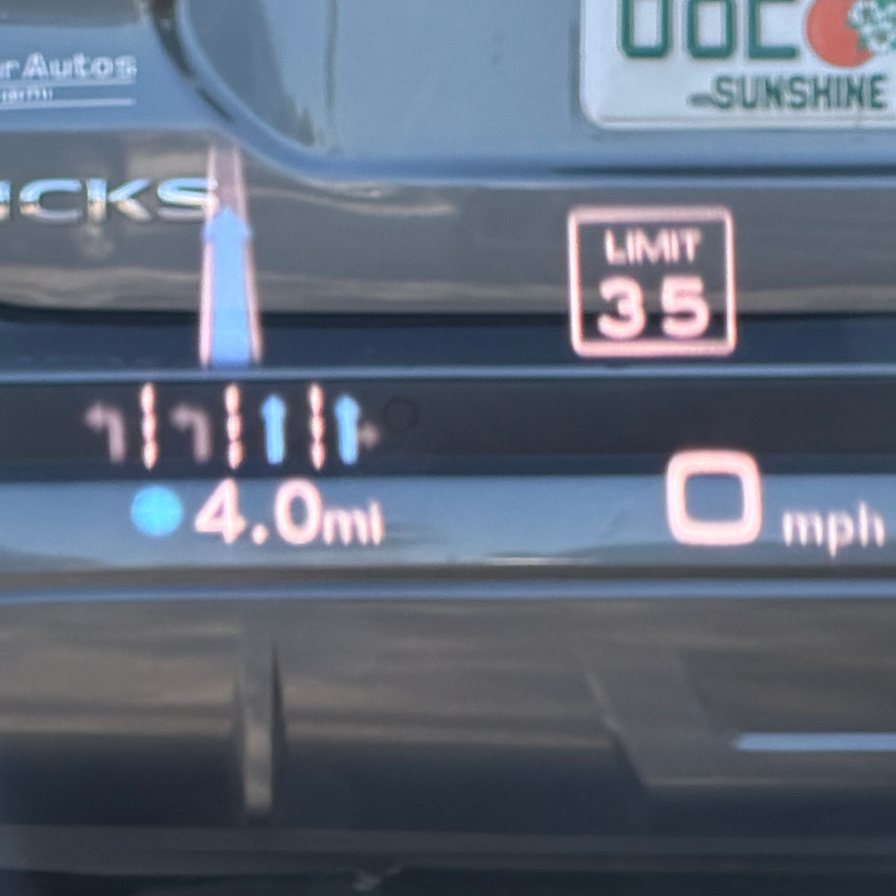
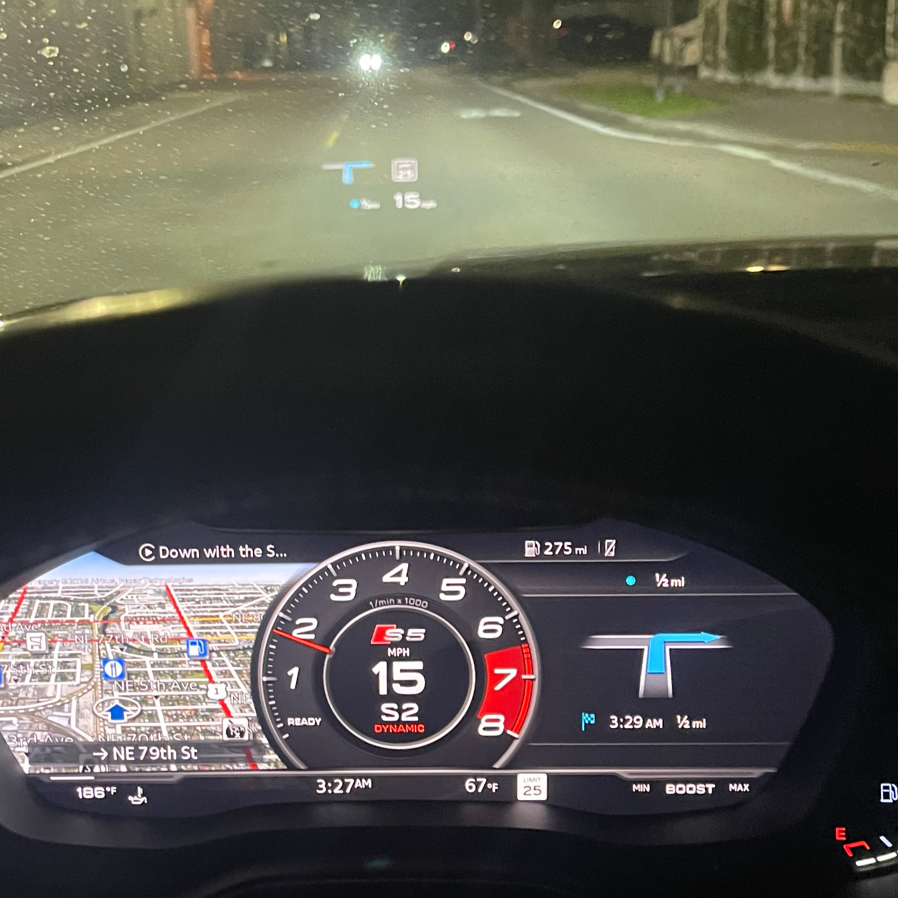
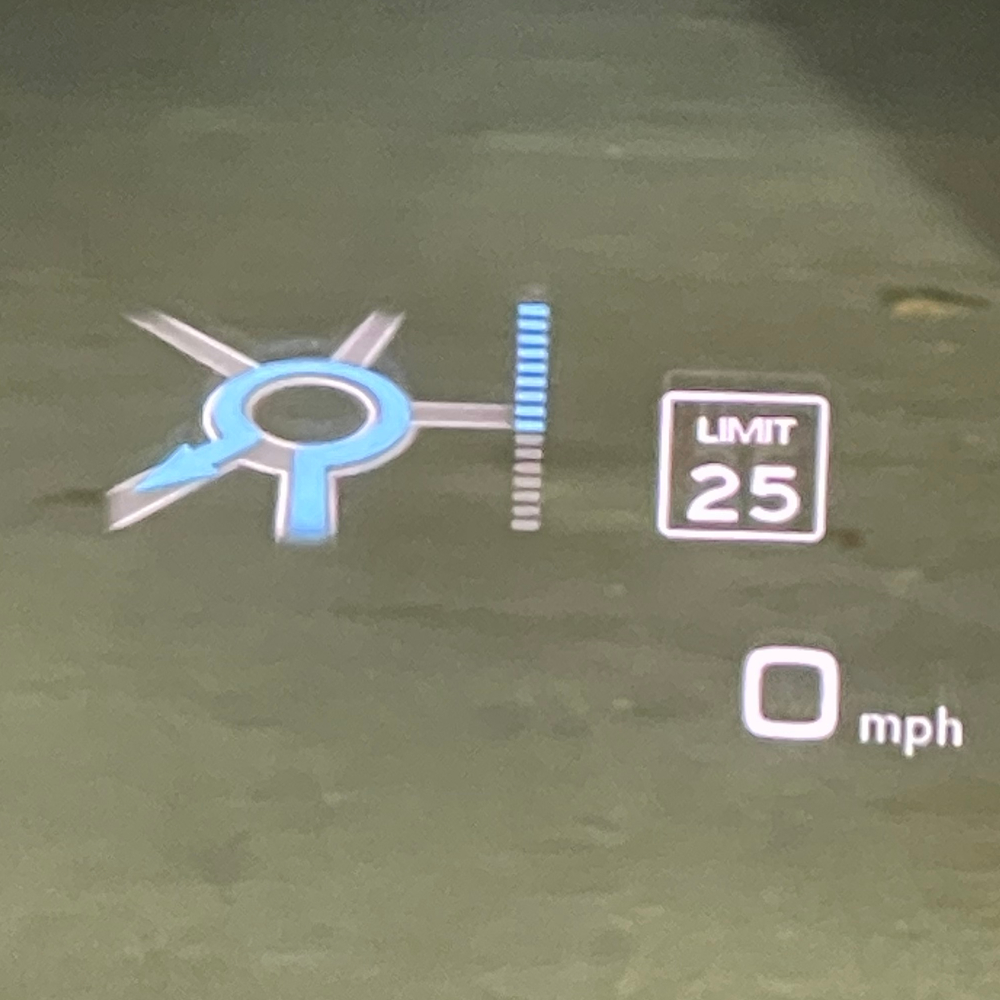
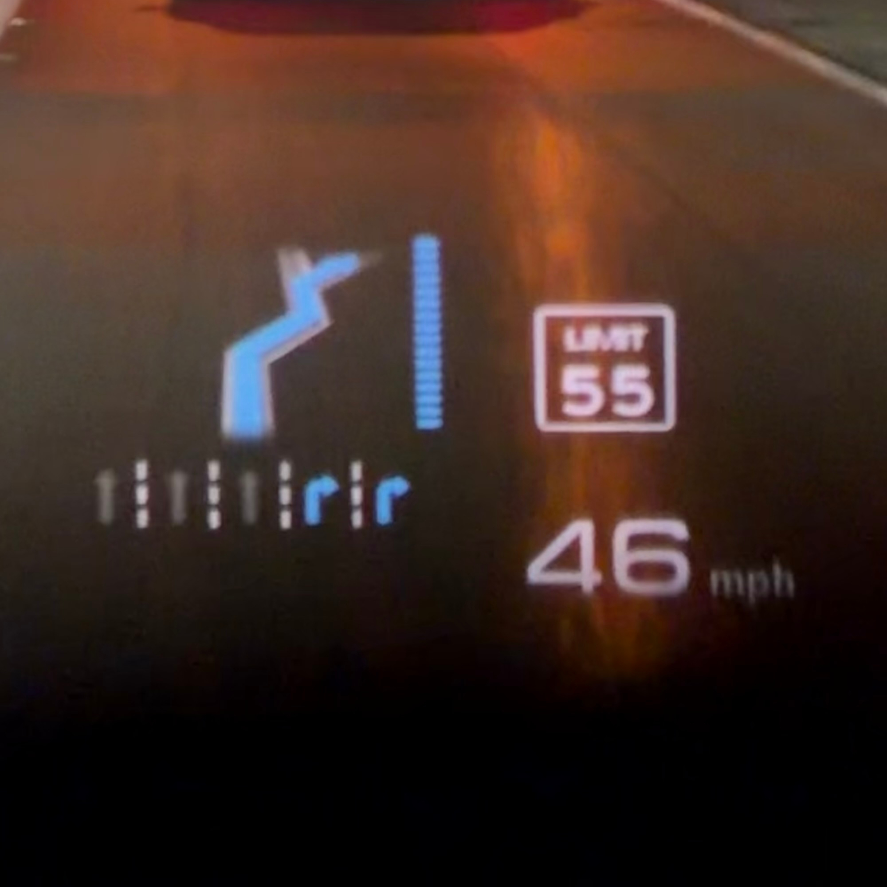
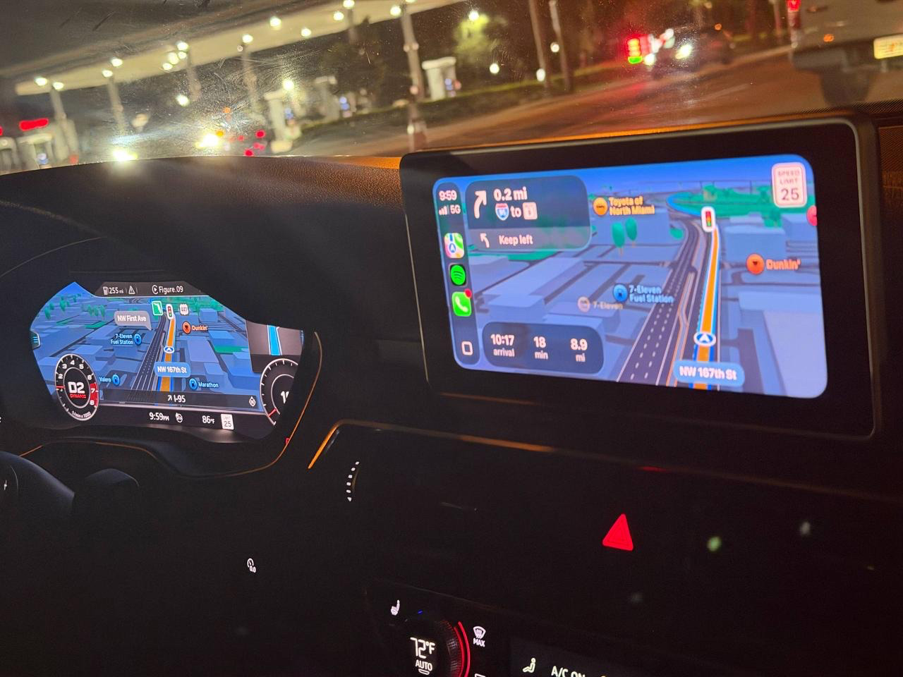

# MHI2Q CarPlay cluster integration

CarPlay patch set for Audi MHI2Q infotainment.
(Based on MHI2Q firmware, but may need rebuild for different versions.)

**Disclaimer:** Use at your own risk. These patches modify firmware binaries and system configurations on your infotainment unit. Always back up all original files before making any changes. The authors are not responsible for any damage, bricked devices, or warranty issues resulting from use of these patches.

## Gallery

<p align="center">
  
</p>
<p align="center">
  
  
</p>
<p align="center">
  
  
</p>

## Contents

- [Gallery](#gallery)
- [Features](#features)
- [Repository layout](#repository-layout)
- [Build](#build)
- [Deployment](#deployment)
- [Logging](#logging)
- [Documentation](#documentation)
- [Known issues & TODO](#known-issues--todo)
- [References](#references)

## Features

What this patch makes the head unit + cluster do that stock MHI2Q doesn't:

- **Full HUD route guidance** from CarPlay nav (Maps, Waze, etc.) - maneuver icons, lanes, distance
  bargraph, ETA and destination.
- **Custom maneuver overlay** drawn over the cluster's native map plane (the same MOST video plane the
  HU uses for its own map), transparent when idle.
- **Album cover art** forwarded to the cluster's now-playing widget.
- **MMI touchpad → DPAD bridging** so finger drags navigate CarPlay menus.
- **Steering-wheel roller** - rotation keeps stock map zoom; the OK press toggles the cluster
  route-info readout (arrival time).

## Repository layout

| Path | Purpose |
| --- | --- |
| `hook/` | Shipping native `libcarplay_hook.so` source |
| `java_patch/` | The only supported Java patch source |
| `maneuver_render/` | GLES maneuver overlay renderer |
| `common/` | Shared QNX Screen surface code |
| `deploy/smartphone_integrator/` | Runtime scripts and child-process configuration for the HU |
| `scripts/` | Docker build entry points (Java / hook / renderer) |
| `toolchain/qnx65-abi/` | QNX Screen ABI headers used only for cross-compilation |
| `docs/` | Obsidian knowledge base - validated RE + implementation notes (open [`docs/INDEX.md`](docs/INDEX.md)) |
| `assets/` | Screenshots and visual reference material |
| `build/` | Canonical deployable artifacts |

Raw unit logs and generated class trees are intentionally kept outside Git.

## Build

Run from the repository root:

```sh
./scripts/build_java.sh        # → build/carplay_hook.jar
./scripts/build_hook.sh        # → build/libcarplay_hook.so
./scripts/build_renderers.sh   # → build/maneuver_render
```

All three build in Docker - no host toolchain required. The Java patch compiles in a pinned
`eclipse-temurin:8` container (against the stock jar + OSGi libs under `../../Tools/jxe2jar`); the two
native builds use the `qnx65-armv7-toolchain` image and synthesize their import stubs, so the resulting
ELF binds the unit's real Screen/EGL/GLES libraries at runtime. There are no Java variants.

The hook logs by default. To adjust at build time:

```sh
./scripts/build_hook.sh                        # LOG=1, logging compiled in (default)
LOG=0 ./scripts/build_hook.sh                  # strip logging entirely
LOG_RGD_PACKET_RAW=1 ./scripts/build_hook.sh   # + raw RGD packet hex dumps (needs LOG=1)
```

Full toolchain, threading and boot details live in the knowledge base - see
[`docs/architecture.md`](docs/architecture.md).

## Deployment

Get a root shell on the unit (SSH), **back up every file you touch**, then just drop the files in
place and reboot.

**1. Copy the runtime files to `/mnt/app/root/hooks/`** (`chmod +x` the scripts):

| Source | Files |
| --- | --- |
| `deploy/smartphone_integrator/` | `carplay_startup.sh`, `carplay_cleanup.sh`, `carplay_processes.sh` |
| `build/` | `libcarplay_hook.so`, `maneuver_render` |
| `maneuver_render/resources/` | `flag_atlas.rgba` |

**2. Point the supervisor at them.** In `/mnt/system/etc/eso/production/smartphone_integrator.json`,
replace the `children.carplay` block with [`deploy/smartphone_integrator/carplay_child.json`](deploy/smartphone_integrator/carplay_child.json).

**3. Register the route-guidance message IDs.** In
`/mnt/system/etc/eso/production/dio_manager.json`, add the RGD message IDs so the Cinemo iAP2 SDK
actually pumps them (without this, iOS sends route guidance and the SDK silently drops it):

- `MessagesSentByAccessory` += `"0x5200"`, `"0x5203"`
- `MessagesReceivedFromDevice` += `"0x5201"`, `"0x5202"`, `"0x5204"`

(The hook separately patches the outgoing Identify so iOS starts sending route guidance in the first
place - both are required.)

**4. Java patch.** Copy `build/carplay_hook.jar` to `/mnt/app/eso/hmi/lsd/jars/`; the HMI loads it on
the next start.

**5. Reboot.** Let the writes reach the flash first - run `sync` and give it a few seconds. A forced
reboot (or pulling power) right after copying can leave the files truncated or gone entirely, and
you will be left wondering why nothing loaded. On boot `smartphone_integrator` launches everything;
check `/tmp/carplay_hook.log` and `/tmp/carplay_java.log` (see [Logging](#logging)).

Exact ownership rules, the `LD_PRELOAD`/env constraints and the MU1316 QNX-compat audit are in
[`deploy/smartphone_integrator/README.md`](deploy/smartphone_integrator/README.md).

## Logging

Both sides write to `/tmp` on the unit:

| File | Source |
| --- | --- |
| `/tmp/carplay_hook.log` | native hook (inside `dio_manager`) |
| `/tmp/carplay_java.log` | Java patch (bounded + rotated, `.1` = previous) |

By default only warnings and errors are recorded. To capture **everything** (lift both hook and Java to
`INFO`), drop a marker file on the unit - no rebuild, no restart of `dio_manager` needed:

```sh
touch /mnt/app/carplay_verbose        # or /tmp/carplay_verbose
```

Remove the marker to return to the quiet default. Logs reset on reboot, so pull them before restarting.
For raw route-guidance packet dumps, rebuild the hook with `LOG_RGD_PACKET_RAW=1` (see [Build](#build)).

## Documentation

`docs/` is an Obsidian knowledge base - one note per topic, each fact validated against code /
firmware / iOS binary. Start at [`docs/INDEX.md`](docs/INDEX.md): architecture & threading, the hook
and bus, route guidance (TLV → BAP → cluster), cluster compositing, input, deploy/connect, the
reverse-engineering references, and a per-note verification status.

## Known issues & TODO

Help wanted - open items on the current branch:

- **Maneuver renderer has no lane guidance.** The BAP HUD renders lane arrows, but the projection
  overlay (`maneuver_render`) does not. Lane data should be plumbed through to the renderer and drawn
  the same way the HUD does.
- **Punch-through during the RGI on/off animation.** While route guidance animates in or out, a hole to
  the stock map layer is briefly visible - the map backing (KDK 101/102) is drawn out of sync with the
  animation. Looks like a timing problem in the show/hide sequence; the backing and the animation need
  to be synchronised.
- **Wrong icon for the ramp exit on the projection.** Leaving a ramp draws a three-section arrow that
  doesn't match the maneuver. Likely an off-ramp mapping bug in `ManeuverMapper` - the projection
  descriptor for that case needs fixing.

**Reporting a bad maneuver icon.** The iAP2→BAP mapping covers all 54 CarPlay maneuver types but has
only been exercised on a limited set of real routes. A snippet of `/tmp/carplay_hook.log` from the
moment plus a note on what was expected helps a lot. The hook logs unrecognised route-guidance messages
as `[HOOK] Unknown 0x52xx msgid=0xNNNN dir=IN len=N` followed by a hex dump - that line is the best
starting point when iOS sends a maneuver type we don't handle yet.

## References

Thanks for the prior work and knowledge that helped figure this out.

- https://github.com/ludwig-v/wireless-carplay-dongle-reverse-engineering
- https://github.com/EthanArbuckle/iPhone18-3_26.1_23B85_Restore
- https://github.com/adi961/mib2-android-auto-vc
- [@fifthBro](https://t.me/fifthBro)

---

<sub>What are you doing all the way down here? There's nothing to see…</sub>

<details>
<summary>…or is there?</summary>

<br>

### 🚀 Coming soon. Maybe. Someday. No promises.

It was just the warm-up, next:

<p align="center">
  
</p>

- **AltScreen** - full CarPlay map, right in cluster
- **Multichannel audio support** - from stereo up to 6- or even 8-channel
- **Apple Spatial Audio**
- **Dolby Atmos** - High Quality 5.1.2 masters
- **Video playback** - an Apple TV on wheels

Stay tuned. 👀

</details>
