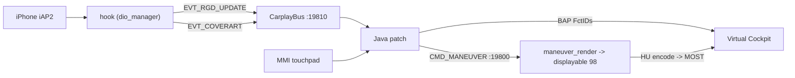

# Architecture - process topology & threading

The one-page overview; each subsystem has its own note. Start at [[INDEX]].

## What the patch does

Production implementation for Audi MHI2Q (MU1316, QNX 6.5 ARMv7) - stock `libairplay.so` 210.81 kept
throughout:

- **Route guidance** - full HUD/BAP maneuver state ([[rgd-activation]] - [[bap-fctids]]) plus a custom
  maneuver overlay drawn over the native cluster map ([[compositing]]).
- **Cover art** - album art forwarded to the VC now-playing widget ([[cover-art]]).
- **Touchpad input** - MMI touchpad drag bridged to DPAD navigation ([[touchpad-dpad]]); steering-wheel
  roller press toggles cluster route-info ([[steering-wheel]]).

The maneuver overlay (`maneuver_render`, displayable 98, transparent when idle) composites over the
head unit's own native map (33): stock ctx 74 at rest, custom ctx 80 `{98,101,102,33}` only while
guidance is active. Base CarPlay stays byte-identical to stock.

## Components

| Component | Type | Output | Topic |
|---|---|---|---|
| `hook/` | C (ARM32 QNX), `LD_PRELOAD` into `dio_manager` | `libcarplay_hook.so` | [[iap2-interception]] [[cover-art]] |
| `java_patch/` | Java 1.4 class overrides loaded by the HMI (`lsd`) | `carplay_hook.jar` | [[rgd-activation]] [[display-contexts]] [[touchpad-dpad]] |
| `maneuver_render/` | C EGL/GLES2 (ARM QNX / macOS) | `maneuver_render` | [[compositing]] |

## Process topology

```text
smartphone_integrator            (boot-resident; spawns on phone connect)
  +- carplay_startup.sh
      +- maneuver_render          TCP 127.0.0.1:19800  (Java -> renderer)
      +- dio_manager              stock libairplay 210.81 + LD_PRELOAD hook

Java patch (lsd.jxe, alive from boot)
  +- CarplayBus server            TCP 127.0.0.1:19810  (hook <-> Java)
```

`LD_PRELOAD` is scoped to `dio_manager` only. See [[supervisor-lifecycle]] for ownership and
[[bus-protocol]] for the hook<->Java link.

## Boot / init

`dio_manager` is **not** spawned at boot - `smartphone_integrator` launches it on phone connect, so
the hook constructor fires only then. The HMI (`lsd.jxe`) starts at boot, so the Java bus server is
already `accept()`ing when the hook connects. Connect sequence: [[connect]].

## Data flow (steady state)



## Threading (highlights)

- **hook**: iAP2 thread (recv/read hooks) - cover-art worker - bus connector/writer - 1 Hz timer.
- **Java**: HMI EDT - `carplay-bus` (bus server IO, + `carplay-bus-writer`/`carplay-bus-reader`) -
  `carplay-cluster-switch` (single DM writer, [[display-contexts]]) - `BAPActionBlink`
  ([[bargraph-sync]]) - `RendererServer` accept/read.
- **renderer**: EGL draw loop - TCP client to Java - a periodic focus check (no dmdt on this branch).

## Build & deploy (quickref)

```sh
./scripts/build_java.sh        # -> build/carplay_hook.jar    (eclipse-temurin:8 Docker)
./scripts/build_hook.sh        # -> build/libcarplay_hook.so   (qnx65-armv7-toolchain Docker)
./scripts/build_renderers.sh   # -> build/maneuver_render      (qnx65-armv7-toolchain Docker)
```

All three build in Docker - no host toolchain. No Java variants; `java_patch/` builds directly to the
jar. The native builds synthesize import stubs; the resulting ELF binds the unit's real
Screen/EGL/GLES libs at runtime.

Deploy by copying the runtime files to `/mnt/app/root/hooks/`, pointing `smartphone_integrator.json`
at `carplay_child.json`, dropping `carplay_hook.jar` into `/mnt/app/eso/hmi/lsd/jars/`, and
rebooting - there is no one-shot flasher. Runtime integration + install paths: [[supervisor-lifecycle]].

## Reverse-engineering references

iOS: [[accessoryd-rgd]] - [[carkitd-bonjour]] - [[maps-maneuvers]]. Firmware:
[[display-manager]] - [[komo-widget-video]] - [[dsi-carkombi]].
