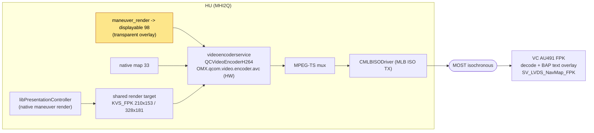

# Cluster compositing - HU -> MOST -> VC video

The cluster map area is not drawn on the VC - the head unit **renders and H.264-encodes** it and
ships it over a MOST isochronous channel; the VC just decodes and overlays BAP text. The patch feeds
its maneuver graphics into that same encoder path.

## Context

> [[display-contexts]] - ctx 80 selects planes -> **compositing** - HU encodes -> MOST -> VC.
> Plane placement: [[kdk-geometry]].

## The stock pipeline

Render targets are created by `libPresentationController.so`'s `SDKRenderTargetFactory`
(`CreateSDKRenderTargetInvoked` @0x89c064, `[SDKRenderTargetFactory]` @0x89c214) via
`CreateRenderKDKTarget` / `CreateRenderExitViewTarget` / `CreateRenderDefaultTarget`
(KDK path decompiled at FUN_0062c7e8, logs "CreateRenderKDKTarget" / "Use already created
KDKRenderTarget"). The encoder path is **downstream in `videoencoderservice`**, not in this .so:
`QCVideoEncoderH264`, `OMX.qcom.video.encoder.avc`, MPEG-TS (`OMX.qcom.transport.mpeg2ts`,
`QCVideoEncoderTS`), and `CMLBISODriver` (MLB ISO TX, `MLB_DEVCTL_*`).

Cluster render size comes from `komoviewstyle.conf` - **DSI value -> EB style -> size**:
`1 -> KVS_Most 800x252`, `2 -> KVS_FPK 210x153`, `3 -> KVS_FPK 328x181`, `255 -> KVS_RGI 263x366`
(4-7 = `KVS_Invalid`). Note the **EB style enum ordinal** inside the binary is a *separate*
numbering (decompiled switch FUN_00638d44): `0 KVS_Invalid, 1 KVS_RGI, 2 KVS_RGI2, 3 KVS_FPK,
4 KVS_Most, 5 KVS_Debug_MoKoInMainDisplay` - don't confuse the enum ordinal with the DSI value.

## How the patch takes over

- `maneuver_render` draws into **displayable 98** with `transparent=1`, so the cluster compositor
  blends it over the KDK backings and the **stock native map (33)** - not over a CarPlay video plane.
- Selecting ctx 80 wires the MOST encoder to read displayable 98
  (`setActiveDisplayable(4, 98)` runs inside the stock context switch). The native map 33 is composed
  behind it, so the VC receives one stream = native map + our maneuver overlay.
- Displayable 98 has no stock owner, so binding it is not a race. The old id-20 takeover / flapping
  is gone - see [[display-contexts]].
- The renderer runs **no `dmdt`**; all context routing is Java-driven from `ScreenModule`.

## Rate

`setUpdateRate(terminal 1, 30)` drives the encoder while ctx 80 is active; returned to the same 30 Hz
after the stock-restore stop/switch sequence so terminal 1 never parks at 0 FPS.
