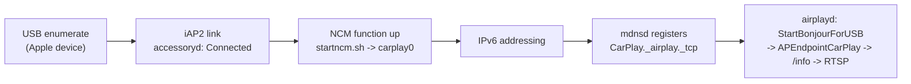
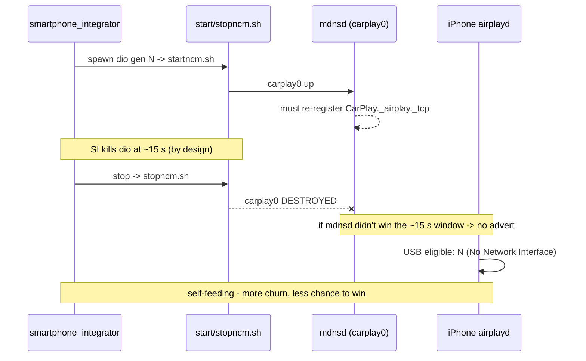

# Connect flow - USB -> NCM -> Bonjour

Wired CarPlay does not start from `carkitd`; it starts from **`airplayd`**, gated on mDNS discovery of
`CarPlay._airplay._tcp.local` on the **NCM link**. `carkitd` only does connection-time bookkeeping.

## Flow

Auth is ~330 ms; the real latency is HU-side NCM addressing.

## The failure - "No Network Interface"

From the failing-evening sysdiagnose, `airplayd` names the reason:

> `[Bonjour/USB] USB eligible: N (No Network Interface)` - 180 of 256 `USB eligible` verdicts.

(All 256 verdicts across the CarPlay helpers: 180 `No Network Interface`, 68 `<disabled>` from the
WiFi-side helpers, 4 `Session Start Timeout`/`No Remote IP`, 1 `No Local IP`, and only 3 `Y`. The
`[Bonjour/USB]` helper alone is 114 `No Network Interface` : 1 `No Local IP` : 3 `Y`.)

iAP2 is healthy throughout (Link Connected, MFi chain parses) and `carkitd` builds its display config
every cycle (`[DISPLAY_CONFIGURATION] Starting USB Bonjour advertising`), but **the USB NCM interface
is not present** when `airplayd` wants to advertise, so it has no network to publish the Bonjour
service on. The one success of the evening shows the gate: the interface appeared (`en3` added,
23:36:57.176) and addressed almost at once (`USB eligible: Y` at 57.184, ~8 ms later); the ~2.9 s lag
was then Bonjour resolution - `StartBonjourForUSB` (59.631) -> `[USB] Bonjour device added/updated`
(23:37:00.030, `CarPlay._airplay._tcp.local.`) -> `Created APEndpointCarPlay [0x441F]` (23:37:00.034),
and the session came up.

## Why it is our defect (the race)

`smartphone_integrator` owns the OTG lifecycle and runs `stopncm.sh` as its per-child cleanup by
design - a dying `dio` generation is normal. Each generation `startncm.sh`/`stopncm.sh` **destroys and
recreates `carplay0`**, so `mdnsd` must re-register `CarPlay._airplay._tcp` every cycle while SI kills
`dio` at ~15 s. That is a self-feeding race: the more the loop churns, the less chance it has to win.
A head-unit reboot clears the accumulated broken state (the first attempt on a clean state wins).

## MHI2Q specifics

- device-controller DLL `devu-usbrndis-msm8960-ci.so` (MSM8960), loaded via
  `io-usb-dcd -d usbrndis-msm8960-ci`; no `usblauncher-Apple.so`.
- `startncm.sh` mounts **`devnp-usbdnet.so` with `protocol=ncm`** (even though `devnp-ncm.so` ships).
- `Device_Stack.cmd = /etc/scripts/start_usb_device_stack.sh`, `connect_poll = 100`,
  `descriptors = {usbdesc_carlife, usbdesc_carplay, rndis}`.

## (!) Open

- root cause of the missing re-registration not fully proven; iOS 26-vs-27 behaviour differs - see
  [[carkitd-bonjour]]. The guarded USB pre-SETUP reset is handled by [[supervisor-lifecycle]].
