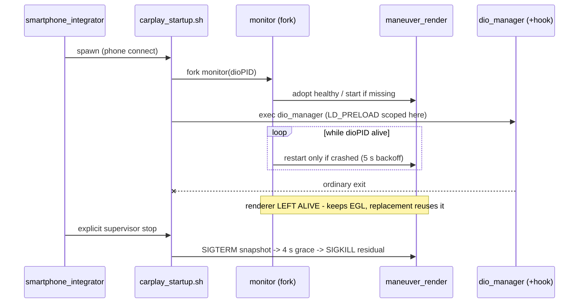

# Supervisor & renderer lifecycle

`carplay_startup.sh` is configured as `children.carplay.exec` in `smartphone_integrator.json`. It owns
`maneuver_render` around the lifetime of `dio_manager`, without ever restarting the Java stack.

## Context

> `smartphone_integrator` (phone connect) -> **carplay_startup.sh** -> monitor + `exec dio_manager`
> (with LD_PRELOAD) - adopts/starts `maneuver_render`. Why the NCM link churns: [[connect]].

## Ownership rules

- `children.carplay.envs` carries **no** `LD_PRELOAD`; the wrapper adds it only to its final
  `dio_manager` process - so neither the shell nor the renderer loads the hook.
- The wrapper **`exec`s** `dio_manager` so SI tracks the exact dio PID (keeping the shell as parent
  made SI kill/relaunch wrappers and the cluster never rose).
- A forked **monitor** watches that PID: it starts a missing `maneuver_render`, preserves a healthy
  one across a fast `dio` replacement, and records an owner generation. Only while that exact dio
  generation is alive does it restart a crashed renderer (5 s backoff).
- Every ordinary `dio_manager` exit **leaves `maneuver_render` alive**, so a replacement inherits the
  existing EGL allocations instead of re-entering fragile Qualcomm `eglInitialize`. Only an explicit
  supervisor stop tears it down (SIGTERM snapshot -> 4 s grace `CP_KILL_GRACE` -> SIGKILL residual).

## Adoption is by live PID

`maneuver_render` is a **client** of Java's route-scoped `:19800` listener, which Java deliberately
closes when RGI is inactive. So a live recorded PID - not a socket probe - is the adoption health
check; treating the closed listener as "unhealthy" would kill/recreate the EGL context every
reconnect.

## Guarded USB pre-SETUP recovery

For the one failure class that happens before RTSP (both iAP2 interfaces matched but only one
running - `drivers_matched::2` + `drivers_running::1` in PPS), the monitor **queues** a one-shot
request; the next SI-owned wrapper consumes it and does at most one physical `reset port 3 250 1`,
latched until a successful control SETUP or reboot. It never resets the connector under a
starting/dying CarPlay process. (Widening the "stuck" test to `running < 2` was measured to make the
state worse - do not.)

## Cleanup is identity-less

`carplay_cleanup.sh` does not know which dio generation it runs for, so it must **not** create the
global stop marker or stop renderers by shared PID files (either could damage a replacement
generation). It only invokes Audi's stock `/etc/scripts/carplay_cleanup.sh` for mdnsd/PPS cleanup.

QNX-6.5 `/bin/sh` compatibility: numeric signals, `pidin ar` finite snapshots (no blocking
`/proc/*/cmdline` walk), no GNU-only tools.
