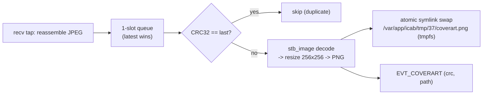

# Cover-art bridge (chunked JPEG -> VC picture)

Stock MHI2Q CarPlay forwards title/artist/album to the VC but never pushes cover art, so the VC shows
a blank album icon. This bridge fills it in.

## Context

> Cinemo `NmeTransport::Recv` -> **cover-art** - reassemble + decode -> tmpfs PNG + `EVT_COVERART` ->
> [[bus-protocol]] -> Java `CoverArt` -> `AppConnectorTerminalMode` picture mgr -> VC.

## Reassembly (on the hook thread)

The cover-art module taps the Cinemo transport at **`NmeTransport::Recv`** (via the framework's
transport-recv sink, not a global `recv` scan), and reassembles the chunked JPEG for the NowPlaying
artwork from `SOI (FF D8) ... EOI`. The hook thread only appends + scans, so iAP2 traffic is never
stalled.

## Async decode worker

The complete JPEG is handed to a **dedicated worker thread** (single-slot pending queue, latest-wins):

This keeps the ~50-100 ms decode off the iAP2 hot path. `stb_image` is vendored; decode runs only on
this single worker (no libc reentrancy issues in an `LD_PRELOAD` .so). The PNG lives on tmpfs -
regenerated each session, lost on reboot (fine: the pipeline restarts every CarPlay handshake). The
`coverart.png` path is a symlink ping-ponged between `coverart_0.png` / `coverart_1.png` and swapped
atomically via `rename()`.

## Java side

`CoverArt` subscribes to `EVT_COVERART`, dedups by CRC, and `AppConnectorTerminalMode` pushes the
image to the BAP picture manager (`ResourceLocator` + `responseCoverArt()`), mirroring the native
`AppConnectorMedia` pattern. Late-arriving art (after track info was already sent) is re-pushed with a
tweaked picture id to force the VC to refresh.
