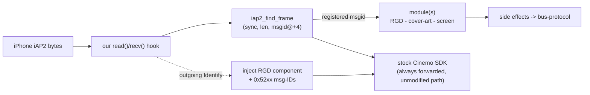

# iAP2 interception & the hook framework

`libcarplay_hook.so` is `LD_PRELOAD`ed into `dio_manager` only. Every iAP2 byte from the iPhone first
passes through our `read()` / `recv()` hooks, then continues into the stock Cinemo SDK. We don't
bypass the stock path - we intercept and inject side effects.

## Context

> iPhone iAP2 -> **iap2-interception** - parse frames, patch Identify -> modules ->
> [[bus-protocol]] - to Java. Cover-art tap: [[cover-art]].

## Framework

`main.c` includes three auto-registering modules (constructors): route-guidance, cover-art,
cluster/screen. `hook_framework` keeps a priority-ordered module registry and routes each parsed frame
to the modules that registered for its `msgid`.

## Frame parsing

`iap2_find_frame` scans the transport buffer for the iAP2 frame sync, reads the frame length, the
`msgid` (**BE16 at offset +4**) and the payload (from +6). Route-guidance frames are `0x5200-0x5204`;
a TLV iterator then walks the payload (see [[rgd-tlv]]).

## Identify patcher

On the outgoing iAP2 **Identification** message the hook injects the extra component the stock Cinemo
SDK never advertises (an EAGroup/route-guidance component) plus the `0x52xx` message IDs, so iOS
registers the accessory as route-guidance-capable and starts sending `StartRouteGuidanceUpdates`.
Without this patch iOS never emits any RGD traffic.

## Checksum

The iAP2 link checksum is applied (NEG, hard-coded) with a one-shot sanity log on the first stock
frame, so an injected/patched frame stays wire-valid.
