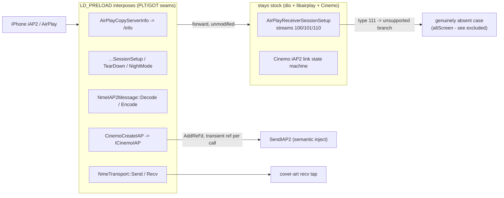

# Stock integration seam

How `libcarplay_hook.so` + the Java patch dock onto the **shipped** MU1316 / MHI2Q stack
(QNX 6.5 ARMv7, stock `dio_manager` + stock `libairplay.so` 210.81 + stock Cinemo). This note keeps
only the non-altScreen conclusions of the seam audit and marks each against current code:
**[x] = matches this branch**, **(!) = open / diverged from the re-notes**.

> The audit does **not** support replacing stock `libairplay`. Every native conclusion comes from the
> real shipped binaries; `Patches/libairplay-mhi2q` was excluded as an authority.

## Context

> Docks onto stock via real PLT/GOT seams. Frame parse + Identify patch -> [[iap2-interception]];
> the `NmeTransport::Recv` tap feeds [[cover-art]]. Whole-system picture: [[architecture]].
> **Excluded here** (altScreen-specific): iOS 26.6 altScreen contract, stream-111 ownership/reconnect,
> and the tiled-NV12->RGBA decode/presentation path.

## What LD_PRELOAD can really intercept [x]

The old blanket rule *"a library's calls to its own exports always bypass `LD_PRELOAD`"* is **false**
for this binary. Correct rule: **classify each callsite as PLT/GOT (interposable) or direct/local
(bypassed)** - being exported is not sufficient. RE traced these as genuine PLT/GOT seams:

- `AirPlayCopyServerInfo` - called through PLT by stock libairplay itself (`_requestProcessInfo`); the working `/info` advertisement seam.
- `AirPlayReceiverSessionSetup` / `...TearDown` / `...SetNightMode` - interposable; the last is a genuine dio->libairplay boundary.
- `CinemoCreateIAP` - genuine dio->Cinemo (libNmeSDK) boundary.

The hook interposes exactly this class of symbol (`Decode`/`Encode`/`NmeTransport::Send`/`Recv`/
`CinemoCreateIAP`, resolved via `RTLD_NEXT`) - consistent with current `hook_framework.c`. [x]

**Stock SETUP behaviour (re-notes):** `AirPlayReceiverSessionSetup` handles stream types 100/101/110;
type **111 hits the unsupported branch**. The hook is therefore not shadowing hidden stock altScreen
support - it supplies a genuinely absent case. *(RE-derived; not re-checkable from repo source.)*

## Cinemo / NME & iAP2 injection ABI

- **NmeArray layout** `{data@+0, len@+4, capacity@+8, growth@+12}`, return 0 = success - the hook reads
  exactly `data@+0`, `len@+4`, `capacity@+8` on the Encode/Recv arrays. [x]
- **Injection object lifetime** [x] - `CinemoCreateIAP` captures the returned `ICinemoIAP` **only after
  the real factory succeeds**, `AddRef`s it before publishing under `g_fw.lock`, and every inject takes
  a **transient** `AddRef`/`Release` around the stock `SendIAP2` (worker path). Owner-PID guarded so a
  forked child never mutates the parent's COM refcount; the previous capture is released after the
  atomic swap. No parallel iAP2 transport is invented.
- **Stock frame first** [x] - `NmeTransport::Send` calls the real send, and only *after* success records
  injection context / notifies modules. LocationInfo is never consumed or used as a delayed carrier.
- The `0x5200` component schema / presence TLVs are **operationally verified, not independently proven**
  from `AirPlaySender`. *(from-re-notes.)*

## Java replacement ABI & lifecycle

- **Outer-class ABI** - the replaced stock outer classes preserve every public/protected constructor,
  method, field and superclass/interface descriptor (`javap -protected -s`). *(from-re-notes.)*
- **Lifecycle** [x] - `CarPlayApp.onActivate` only records the desired context/generation and wakes a
  persistent **daemon lifecycle worker**; `lifecycleLock` serializes module start/stop, and the general
  state lock is **not** held across `Module.start` (former lock inversion gone). Pending modules retry.
- **Nav-status gate** (!) - present, but the class is **`ScreenNavStatusGate`** on this branch (re-notes
  say `AltScreenNavStatusGate`; renamed away from the altScreen prefix).
- **Strong context ownership** [x] (policy, deliberately > stock ABI) - while
  `ScreenModule.isConnected()`, `DisplayManagerMIB2High.switchContext` rejects every cluster-terminal
  physical context write except the one serialized `ScreenModule` worker (reconciles every **250 ms**).
- (!) **Diverged:** `isConnected()` is now `platformSupported && connected` - the intent-based
  `connected || videoAvailable` term from the re-notes is **gone**, so the "blocks a legit transition
  while video is recovering" caveat no longer applies as written. Class renamed `AltScreenModule` ->
  `ScreenModule`.
- (!) **Resolved on this branch:** the map-scale / altitude **sentinel** (`updateMapScale(15,false,
  0xffff,0xff,false)`) is removed - `GatedCombiService` now passes scale/altitude straight through so the
  cluster's native readouts stay visible. The historical "Navigation unavailable" concern is moot here.

## Startup, cleanup & process ownership

- [x] **LD_PRELOAD is scoped to `dio_manager` only** - `carplay_startup.sh` exports the private
  `LD_PRELOAD=$H/libcarplay_hook.so` **only immediately before `exec dio_manager`**; renderers are
  launched with `LD_PRELOAD=` cleared and `GRAPHICS_ROOT=/proc/boot`. This is the operational mitigation
  for the fail-open process gate below.
- (!) **Supervisor grace race** (from-re-notes) - the old monitor waits exactly **2 s** for a replacement
  owner while the child restart delay is also 2 s; scheduling slop can let the old monitor stop
  renderers the replacement meant to adopt. Use a grace > restartDelay or an atomic owner token.
- (!) PID-reuse (recorded-PID check validates `/proc/<pid>` existence, not exe identity) and a fail-open
  `netstat` health check remain bounded risks. *(from-re-notes.)*

## Hardening findings

- **FIXED - RGD module work from the ELF constructor** [x] (K1004 investigation, 2026-08-31).
  The exact hook shipped in the standalone `carplay-rgi-new` package used an RGD constructor which
  called `rgd_init()` at `dlopen` time. Registration immediately entered the logger's lazy init and
  could create its pthread while QNX `ldqnx` still held the loader lock, before iAP2 Identify. RGD is
  now registered from the framework's first real Cinemo interpose instead. The build rejects any
  reintroduced `rgd_module_init`/`rgd_module_fini` and requires `.init_array` to be exactly four bytes
  (the compiler's `frame_dummy` entry only). The one-time WARN
  `lazy runtime init complete (constructor-free; first Cinemo boundary)` is the live boundary marker.
  Fresh standalone artifact: `build/libcarplay_hook.so`, SHA-256
  `1dfee4db2d3ff836e518bd53b0adfd3652b0ba1fa112f37390fc4a9f55feedcb`.
- **FIXED - eager cover-art constructor** [x] (confirmed resolved on this branch). Cover art declares
  its `NmeTransport::Recv` tap in its module def; the framework runs its `pthread_once`-backed
  `on_init` from the lazy first-Cinemo-call boundary - **no thread is created there**. The worker is
  created lazily on the first complete image (joinable, latest-wins). The tap stays declared for the
  life of the process: shutdown quiesces copied callbacks and then **joins** the worker before stopping
  the bus, which was always the real barrier (an unregister could never stop a caller that had already
  copied the function pointer). Helper processes stay fully inert (gated on
  `hook_process_is_dio_manager`).
- **P2 - excessive ELF export surface** (!) **open.** No `-fvisibility=hidden` / version-script in the
  hook build; the object still exports far more than the intended interposes. Every exported helper is a
  future accidental-preemption surface.
- **P2 - fail-open process gate** (!) **open in code** (mitigated). `hook_process_is_dio_manager()` returns
  **true** when `/proc/self/cmdline` can't be opened/read (fail-open). Mitigated because the startup
  script restricts `LD_PRELOAD` to `dio_manager`; fail-closed would still be safer.
- **P2 - framework state concurrency** (!) **open.** The `ICinemoIAP` object and injection context are now
  under `g_fw.lock`, but not every read/write of the shared `g_fw.ctx` fields is under one state lock -
  it rests on stock serializing the relevant NME callbacks. No log proves a race; still an external
  assumption.

## Bottom line

The decisive native seams are present in the exact shipped binaries and are interposed correctly, the
Java outer-class ABI is preserved, and `LD_PRELOAD` is confined to `dio_manager`. The **RGD module and
logger are now constructor-free**, and the eager cover-art loader thread is gone. The two section 6
re-notes that no longer match code
(`videoAvailable` intent term, and the map-scale sentinel) have both been **simplified out** on this
branch. Remaining non-altScreen work is bounded hardening: ELF visibility, fail-closing the process
gate, tightening `g_fw.ctx` locking, and the supervisor 2 s ownership margin.
