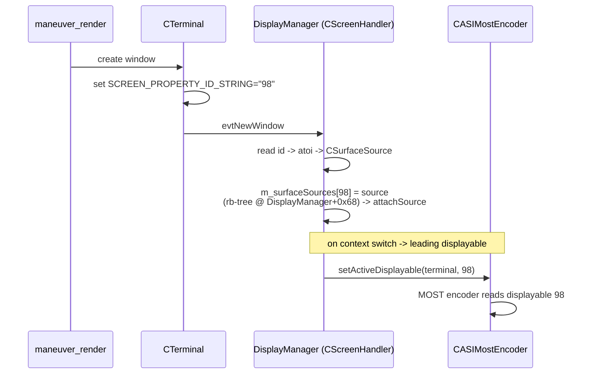

# DisplayManager & dmdt (MU1316)

The service that owns cluster/main-display **contexts** and binds each **displayable** to a screen
window. Implementation backing [[display-contexts]].

## Contexts & window binding

A *context* is an ordered list of displayable ids per terminal; the compositor draws them front-to-
back. Each terminal window is created and named in `CTerminal`:
`screen_create_window_type(&m_window, ..., SCREEN_APPLICATION_WINDOW)` then
`screen_set_window_property_cv(m_window, SCREEN_PROPERTY_ID_STRING, m_name.size(), m_name.c_str())`,
so the window carries `SCREEN_PROPERTY_ID_STRING="<id>"`. On the DM side the
`CScreenHandler::evtNewWindow` callback (`screen_handler.cxx`) reads that id back
(`screen_get_window_property_cv(window, SCREEN_PROPERTY_ID_STRING)` -> `atoi`), creates a
`CSurfaceSource`, and binds it into the id->`CSurfaceSource` map (`m_surfaceSources`, the red-black
tree at `DisplayManager+0x68`), then `attachSource`s it to the displayable. A displayable with no
stock owner (e.g. **98**) has an empty slot before we start, so binding it is not a race - see
[[compositing]].

`CASIMostEncoder::setActiveDisplayable(terminal, id)` wires the MOST encoder to read that displayable
(it records the mapping, then forwards to the video-over-MOST proxy); the stock context switch runs
it for the leading displayable of the context.

## dmdt

`dmdt` is a thin CLI client for the Display Manager debug IPC (`asi.displaymanager.DebugTool` /
`DebugToolReply`), via a `DMRCClient` comm agent on domain `local`. It sends one request, waits for
the async reply, prints it, sleeps 50 ms (`nanosleep`, `tv_nsec=50000000`), then `_Exit(0)` - it
holds **no local state**. `main` @ `0x106050` starts the agent and builds the proxy
(`comm::Proxy` @ `0x103278`); useful for inspecting contexts (`dmdt gs`, `dmdt gd`) but the patch
drives context switching from Java, not dmdt (the renderer runs no dmdt - see [[display-contexts]]).

## Why we don't use libdisplayinit

`cluster_surface` creates the managed window with raw `screen_create/manage_window` instead of
`libdisplayinit`, so `maneuver_render` can create displayable 98 standalone (no HMI screen
connection inherited) - see [[compositing]].
