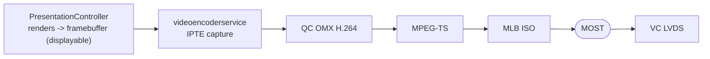
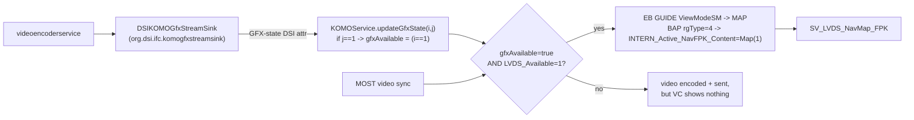

# KOMO widget video & gfxAvailable gate

The stock cluster video pipeline (which [[compositing]] hooks into) and the flag that lets the VC
actually show it.

## Pipeline

## Widget size - komoviewstyle

Widget render size comes from `komoviewstyle.conf`. The current MHI2Q FPK cluster widget is
**`KVS_FPK`** - DSI 2 = **210x153**, DSI 3 = **328x181** (agrees with [[compositing]]). Other styles:
`KVS_Most` **800x252** (MOST display, DSI 1), `KVS_RGI` **263x366** (old MIB1 style, DSI 255);
DSI 4-7 = `KVS_Invalid`.

`KVS_RGI2` exists only as **EB style enum ordinal 2** in the binary (switch FUN_00638d44:
`0 Invalid / 1 RGI / 2 RGI2 / 3 FPK / 4 Most / 5 Debug_MoKoInMainDisplay`) and has **no DSI
assignment** in this build's `komoviewstyle.conf`. There is no `363x260` size anywhere in the
firmware - the earlier "KVS_RGI2 363x260" claim was wrong (a scramble of RGI's 263x366).

## The gfxAvailable gate

The VC only transitions to LVDS map view (`SV_LVDS_NavMap_FPK`) when **`gfxAvailable=true`** - else the
video never shows even though it is encoded and sent. The flag is driven by the KOMO GFX-stream-sink
DSI interface, and combined with `LVDS_Available=1` (from MOST video sync) it walks the EB GUIDE state
machine to the map view:

Verified as strings in this extract: `DSIKOMOGfxStreamSink` (traceConfig.properties + DSITracer.jar),
`updateGfxState` and `KOMOService` (diag.jar / DSITracer.jar). **Not found literally** here:
`ATTR_GFXSTATE`, `setGFXAvailable`, `ClusterViewMode` - likely EB GUIDE HMI-model symbols not shipped
in this firmware dump, so treat those exact names as inferred. None of this chain lives in
`libPresentationController.so`.

## Relevance to the patch

Publishing our maneuver stream is not enough; the cluster must also see `gfxAvailable=true`. This is
why the renderer startup handshake gates the MOST video path on a confirmed first frame before the
cluster context switch - a broken/blank stream must never be published. See [[display-contexts]] and
[[compositing]].
