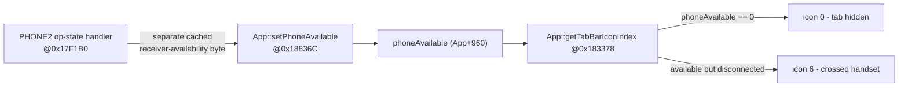

# Phone-tab gating (abandoned experiment)

> **Not shipped. Disabled/rolled back.** Kept as an investigation record: what was tried to hide the
> stock crossed-out telephone tab while CarPlay owns telephony, and why it did not work. If revisited,
> start from "the real lever" below.

## Goal & rule

While CarPlay owns the phone, hide the stock crossed-out PHONE2 telephone tab in the cluster; restore
it only once MMI HFP telephony is actually available again.

```text
tabVisible = (mobileConnectionType == HANDS_FREE_PROFILE /*3*/) && !carPlayActive   // fail-open
```

## What was built (and why it failed)

A `PhoneTabGate` combined two inputs and drove a PHONE2 BAP lever:

- **Source A - recovery:** `BAPPropertyTelFSGSetup.updateAsync()` -> `setMobileConnectionType(i)` (real
  stock HFP enum; decides when HFP is back and the tab may return).
- **Source B - prompt hide:** `TerminalModeBapCombi.ActiveDeviceStateListener` ->
  `setProjectionActive(isCarplayDevice())` (CarPlay is identifiable during ATTACHED/ACTIVATING, before
  the telephony bundle republishes FSG setup).
- **Lever:** override `InitializationManagerPhone2.updateHMIState()` -> send PHONE2 **LSG 41 (0x29)**
  state **NOT_READY (0)** via `IDSIBAPController` (re-sent even if cached state is already 0, to beat
  the `NullDSIBAPService` window). Late `registerResend()` replays the hidden state when PHONE2
  registers after terminal mode.

**Outcome:** v1 didn't hide the tab (three diagnostic holes: a hide before PHONE2 registration was
lost; a `NOT_READY` write landing in the null DSI service then skipped as "already 0"; swallowed
errors). **v2 caused two telephone icons at once** - forcing LSG 41 `NOT_READY` made the VC switch/fall
back between its separate **Telephone** and **Telephone2** domains instead of hiding the shared slot,
so the lever was **rejected** and the gate disabled.

## The real lever (VC side)

The visual target is exact - force the VC's cached **`phoneAvailable = 0`**:



Crucially, `setPhoneAvailable` is fed by a **separately cached receiver-availability byte** in the
handler at `0x17F1B0` - it is **not** derived directly from `PhoneModuleState_Status` or the FSG
operation-state value. So gating `AppConnectorPhone2.updatePhoneModuleState()` (an earlier proposal)
would not work either, and is unsupported by the binary.

## If revisited

Find the true publisher of `BAP_Telephone2_Available` / the VC receiver-availability byte and drive
**that** to 0 - changing the CarPlay/HFP source logic again cannot fix the rejected HMI-state lever.
The rollback JAR removes `PhoneTabGate` and both source calls; PHONE2 is fully back to stock.
