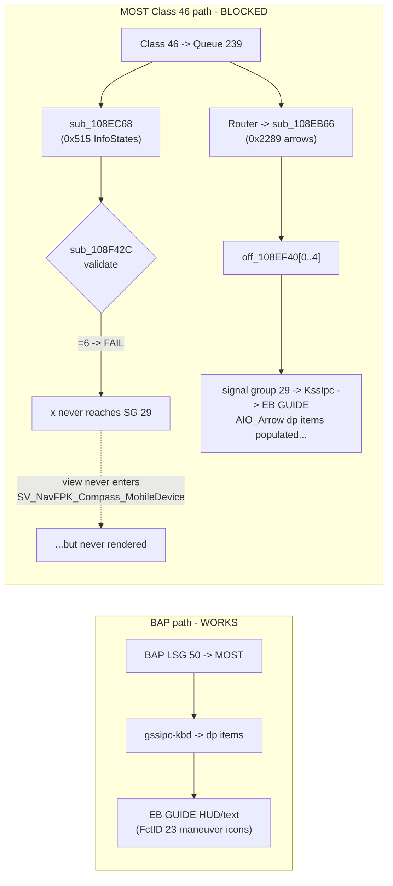

# VC AIO-arrow path - why InfoStates=6 is blocked

**The VC-native "AIO arrow" maneuver icons cannot be driven from CarPlay.** This is *the* reason
maneuvers ship over BAP `ManeuverDescriptor` (FctID 23) instead - see [[bap-fctids]] / [[maneuver-mapping]].

## Context

> Two independent VC data paths: **BAP** (FctID 23 -> HUD, works) vs **MOST Class 46 -> KSS -> EB GUIDE**
> (AIO arrows, blocked). This note is why the second path is a dead end.

## Two paths on the VC



BAP (Class 50) and Class 46 are separate MOST message types that never overlap for nav data:
`gssipc-kbd` handles BAP; KSS handles Class 46.

## Root cause - the InfoStates validator rejects 6

`SV_NavFPK_Compass_MobileDevice` (the view that renders AIO arrows) requires **InfoStates = 6
(MobileDevice)**. InfoStates arrives as MOST `0x515` -> `sub_108EC68` -> validator `sub_108F42C`:

```c
BOOL validate_infostates(unsigned int a1) {
    return a1 <= 0xF && (a1 & 5) != 4 && (a1 & 0xA) != 8;  // bit2 requires bit0, bit3 requires bit1
}
```

**6 = `0b0110`** has bit 2 set without bit 0 -> `(6 & 5) == 4` -> **FAIL** (asm `108f436 BEQ -> return 0`).
So `BAP_NavSD_InfoStates_States` is never set to 6, the view never activates, and the AIO arrows are
never drawn - even though the arrow bytes (`0x2289` -> `off_108EF40[0..4]`) *are* populated.

| value | binary | result |
|---:|---|---|
| 0,1,2,3,5,7,10 | - | PASS |
| 4 | 0100 | FAIL `(v&5)==4` |
| **6** | **0110** | **FAIL `(v&5)==4`** |
| 8,9 | 1000/1001 | FAIL `(v&0xA)==8` |

## Why it cannot be fixed

The VC runs KSS AUTOSAR (`KSSApplication.bin`) in a **secure** environment. UDS `WriteMemoryByAddress`
patches are **RAM-only** (lost every reboot), there is no persistent flash write from a diagnostic
session, and a persistent fix would need ODIS attached at every boot. So the MobileDevice/AIO-arrow
approach is **not viable** - maneuvers use the BAP HUD path instead.

## Anchors (KSS AU491 FPK)

`sub_108F42C` InfoStates validator - `sub_108EB66` arrow handler (0x2289, 5 bytes, per-arrow enable
bitmask at `off_108EBCC[108]`) - `sub_108EC68` InfoStates handler (0x515) - shared signal group 29 at
`off_108EF40` (arrows [0..4] + InfoStates [5]). Full msg-ID map (0x500-0x522 nav, Class 34/49) in the
reconciled source.
