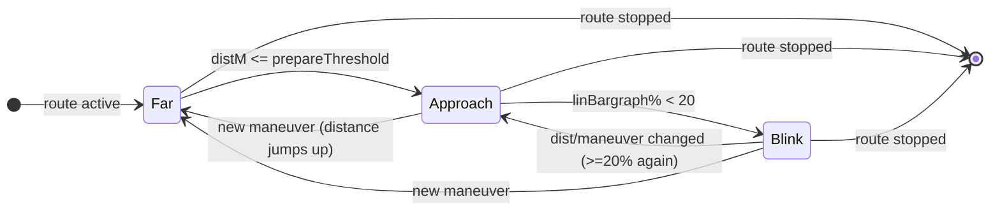

# Bargraph fill & call-for-action blink

The next-maneuver distance bargraph (FctID 18) must fill continuously and blink at the maneuver
point, but iOS sends `0x5202 ManeuverUpdate` only every ~1-3 s. `BAPBridge` smooths that with a
distance->fill formula plus a dedicated blink thread.

## Context

> [[rgd-activation]] - active -> [[bap-fctids]] - FctID 18 -> **bargraph-sync** - fill + blink -> HUD

## Fill formula

`linBargraph% = clamp(distM * 100 / prepareThreshold, 0, 100)`. The denominator is the prepare
threshold for the maneuver class, so a long highway approach fills more gradually than a city one.

| Constant | Value | Meaning |
|---|---:|---|
| `CITY_PREPARE_THRESHOLD_M` | 1500 m | Approach denominator, city maneuver |
| `HIGHWAY_PREPARE_THRESHOLD_M` | 3000 m | Approach denominator, highway maneuver |
| `HIGHWAY_STEP_THRESHOLD_M` | 2000 m | distance above which a maneuver counts as highway-class |
| `BARGRAPH_ACTION_PERCENT_OF_PREPARE` | 15 % | call-for-action arm point |
| `BARGRAPH_BLINK_PERCENT` | 20 % | enter Blink phase below this fill |
| `ACTION_BLINK_INTERVAL_MS` | 600 ms | blink toggle period (50 % duty) |

## Phases

## Blink thread

A dedicated `BAPActionBlink` daemon (spawned only while a route is active) toggles the bargraph
between 100 % and 0 % every 600 ms and re-sends FctID 18 (HUD) plus a `CMD_MANEUVER` tick to the
renderer. This is **independent of iAP2 cadence**: even if iOS goes silent for 2 s the blink keeps
animating in lock-step on HUD and renderer. A `generation` counter invalidates a stale thread on
every start/stop so an old cycle can never double up the blink.

## FSG-sync workaround

`sendStatusIfChanged` drops a BAP update when nothing in `{FctID 23, 18, 49}` changed. On every
ManeuverDescriptor send, `BAPBridge` toggles the cosmetic `exitViewNum` variant on FctID 49 (Exitview)
to force a transmission - without it the cluster occasionally misses bargraph ticks during a fast
approach. FctID 49 is part of the FctSync member set, see [[bap-fctids]].
