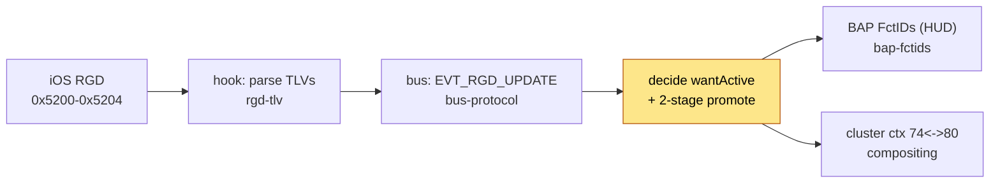
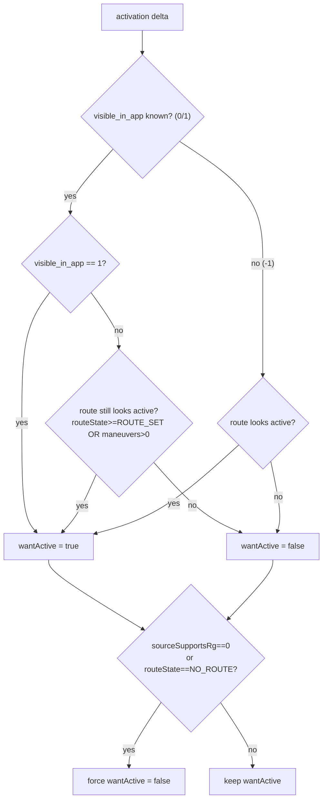
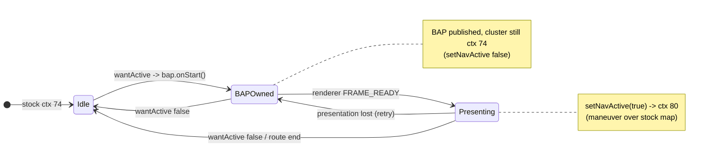

# RGD activation & the `visible_in_app` authority

How the patch decides that CarPlay route guidance is **active** (cluster shows the maneuver overlay)
versus **inactive** (return to the stock cluster).

## Context

Where this sits in the route-guidance path - **you are here** decides *active/inactive*; everything
upstream just delivers state, everything downstream renders it:

> [[rgd-tlv]] - parse TLVs -> [[bus-protocol]] - EVT_RGD_UPDATE -> **rgd-activation** - decide active ->
> [[bap-fctids]] - HUD + [[compositing]] - cluster overlay

## The decision

`RouteGuidance` recomputes `wantActive` on every activation-relevant delta from three iAP2 inputs:

| Input | iAP2 source | Meaning |
|---|---|---|
| `routeState` | RouteGuidanceState (TLV 0x01) | 0=NO_ROUTE ... 1=ROUTE_SET ... 5=REROUTING |
| `maneuverCount` / maneuver list | ManeuverCount (0x0E) / CurrentList (0x0D) | how many maneuvers are queued |
| `visible_in_app` | **RouteGuidanceBeingShownInApp** (0x0F) | is the nav app's guidance UI on screen |

## `visible_in_app` is a visibility flag, not a route-active flag

`visible_in_app` is iAP2 RouteGuidanceUpdate **TLV 0x0F** = Apple's
`ACCNav_RGUpdate_RouteGuidanceBeingShownInApp` (accessoryd 23G71,
`+[ACCNavigationRouteGuidanceUpdateInfo keyForType:]`, case 0xF). It reports whether the nav app's
guidance UI is currently **on screen** - a separate field from `RouteGuidanceState` (0x01),
`ManeuverCount` (0x0E) and `SourceSupportsRouteGuidance` (0x14). iOS sends it `0` for third-party maps
and whenever the nav app is not the foreground CarPlay app, **even mid-route**.

Therefore `visible_in_app==0` must **not** deactivate while the route still looks active; genuine
end-of-route is caught by the `routeState==NO_ROUTE_SET` hard override. See [[rgd-tlv]] for the full
TLV map and [[accessoryd-rgd]] for the enum evidence.

## Two-stage activation (why the cluster doesn't flicker)

`wantActive` rising does **not** immediately switch the cluster to the maneuver context:

- **Stage 1** - own BAP and publish the start sync, but keep stock ctx 74 (`setNavActive(false)`).
- **Stage 2** - only after `maneuver_render` confirms a rendered frame does `setNavActive(true)`
  promote the cluster to ctx 80 -> see [[compositing]] / [[display-contexts]].

## Transient `route_state=0` is debounced in the C hook

`hook/routeguidance/rgd_hook.c` holds a deferred flush for `route_state=0` so a momentary reset /
reroute never reaches Java as a deactivation - any deactivation Java sees is genuine
(`source_supports_rg=0`, `visible_in_app=0` with no route, or a real route end).

## Open / to-verify

- (!) `routeState==5` (REROUTING) "accept all maneuvers" path is documented for MHI3 but not
  implemented here - decide if needed. See [[maps-maneuvers]].
